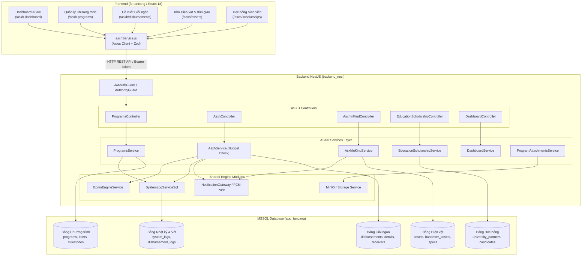
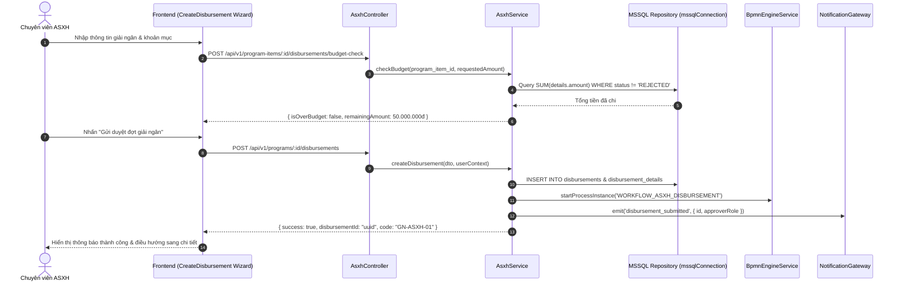

# BÁO CÁO PHÂN TÍCH KIẾN TRÚC & KẾ HOẠCH MIGRATION
# PHÂN HỆ 01: QUẢN LÝ AN SINH XÃ HỘI (ASXH)

**Dự án:** EOffice Migration (`eoffice` $\rightarrow$ `EOffice_new`)  
**Vai trò:** Senior Software Architect + Code Migration Engineer  
**Trạng thái phân tích:** Hoàn thành 100% (Dựa trên đối soát mã nguồn thực tế)  
**Phạm vi:** Backend NestJS (`src/asxh/`), Database MSSQL (31 Entities), Frontend React (`src/pages/ASXHManagement/`, `src/pages/ASXHRegistration/`, `src/pages/DashboardASXH/`)

---

# 1. TỔNG QUAN PHÂN HỆ (EXECUTIVE SUMMARY)

Phân hệ **An Sinh Xã Hội (ASXH)** là hệ thống quản lý toàn diện các chương trình tài trợ cộng đồng, đền ơn đáp nghĩa, học bổng giáo dục và viện trợ nhân đạo của doanh nghiệp. Phân hệ được thiết kế theo kiến trúc Module hướng Domain (DDD) với 5 tiểu phân hệ nghiệp vụ độc lập nhưng liên kết chặt chẽ:

```
┌─────────────────────────────────────────────────────────────────────────────────────────┐
│                                 PHÂN HỆ AN SINH XÃ HỘI (ASXH)                           │
├───────────────────┬───────────────────┬───────────────────┬───────────────────┬─────────┤
│  1. QUẢN LÝ       │  2. GIẢI NGÂN     │  3. HIỆN VẬT &    │  4. HỌC BỔNG &    │ 5. BI & │
│  CHƯƠNG TRÌNH     │  KINH PHÍ         │  BÀN GIAO TÀI SẢN │  ĐỐI TÁC TRƯỜNG   │DASHBOARD│
├───────────────────┼───────────────────┼───────────────────┼───────────────────┼─────────┤
│• Lập kế hoạch     │• Tạo đợt giải ngân│• Danh mục tài sản │• Hồ sơ trường ĐH  │• Tổng KPI│
│• Dự toán kinh phí │• Kiểm tra ngân    │• Thông số kỹ thuật│• Hạn ngạch (Quota)│• Xu hướng│
│• Mốc tiến độ      │  sách realtime    │• Nhà cung ứng     │• Hồ sơ ứng viên   │• Cơ cấu  │
│• Phân công nhân sự│• Đơn vị thụ hưởng │• Đợt bàn giao     │• Đánh giá kết quả │  kinh phí│
│• Hồ sơ văn bản    │• Chứng từ UNC/HĐ  │• Checklist kiểm định│• Trao học bổng  │• Địa bàn │
└───────────────────┴───────────────────┴───────────────────┴───────────────────┴─────────┘
```

---

# 2. LAYER 1 — PHÂN TÍCH NGHIỆP VỤ (BUSINESS LAYER)

### 2.1. Danh sách Tác tử (Actors) & Quyền hạn
1. **Chuyên viên Ban ASXH / Tổ công tác:** Khởi tạo chương trình, lập dự toán, thêm tài sản hiện vật, lập hồ sơ ứng viên học bổng, lập đề xuất giải ngân và tổ chức bàn giao.
2. **Lãnh đạo Phòng/Ban ASXH (Approver):** Xem xét, phê duyệt kế hoạch chương trình, thẩm định đợt giải ngân và phê duyệt danh sách nhận tài trợ.
3. **Ban Tổng Giám đốc / Hội đồng Quản lý Quỹ:** Phê duyệt chủ trương tài trợ, quyết định hạn mức ngân sách lớn và ký duyệt đợt bàn giao cấp cao.
4. **Bộ phận Kế toán thanh toán:** Tiếp nhận hồ sơ giải ngân đã duyệt, kiểm tra chứng từ (Ủy nhiệm chi, Hóa đơn VAT, Biên bản nhận tiền), thực hiện chuyển tiền và xác nhận hoàn tất giải ngân.
5. **Đối tác Giáo dục (Trường Đại học/Cao đẳng):** Ký kết thỏa thuận hợp tác (MOU), gửi danh sách đề cử sinh viên vượt khó học giỏi theo chỉ tiêu Quota được giao.
6. **Nhà cung ứng (Suppliers):** Cung ứng tài sản, trang thiết bị, vật tư tài trợ theo hợp đồng.
7. **Đơn vị / Cá nhân thụ hưởng (Receivers):** Tiếp nhận hiện vật, học bổng hoặc tiền hỗ trợ và ký biên bản giao nhận.

---

### 2.2. Chi tiết 4 Luồng Nghiệp vụ Trọng tâm

#### Luồng 1: Vòng đời Chương trình ASXH (Program Lifecycle)
- **Input:** Tên chương trình, Mã chương trình (tự sinh định dạng `ASXH-YYYY-XXXX`), Loại nguồn vốn (`NGAN_SACH_CONG_TY`, `QUY_DONG_GOP`, `TAI_TRO_NGOAI`), Tổng ngân sách, Thời gian thực hiện, Địa bàn triển khai (Tỉnh/Thành, Quận/Huyện), Văn bản liên kết (Văn bản đến/tờ trình phê duyệt).
- **Business Rules:**
  - Tổng ngân sách các hạng mục con (`program_items.budget`) không được vượt quá Tổng ngân sách chương trình (`programs.total_budget`).
  - Mốc tiến độ (`program_milestones`) phải nằm trong khoảng thời gian hiệu lực từ `start_date` đến `end_date` của chương trình.
  - Mã chương trình sinh tự động duy nhất theo năm.
- **Trạng thái chuyển đổi (Status Transitions):**
  $$\text{DRAFT (Dự thảo)} \longrightarrow \text{PENDING\_APPROVAL (Chờ duyệt)} \longrightarrow \text{ACTIVE (Đang thực hiện)} \longrightarrow \text{COMPLETED (Hoàn thành)} \Big/ \text{CANCELLED (Hủy)}$$

#### Luồng 2: Quy trình Giải ngân Kinh phí (Disbursement Flow)
- **Input:** ID Chương trình, ID Hạng mục chi phí, Số tiền đề xuất, Đơn vị thụ hưởng (Tên, MST, Số tài khoản, Ngân hàng, Chi nhánh), File hóa đơn/chứng từ, Danh sách chi tiết giải ngân.
- **Business Rules (Realtime Budget Check):**
  $$\text{Số tiền đã giải ngân lũy kế} + \text{Số tiền đề xuất đợt này} \le \text{Dự toán hạng mục chi phí}$$
  - Nếu vượt dự toán $\rightarrow$ Hệ thống cảnh báo đỏ và chặn không cho trình duyệt.
  - Tự động sinh mã đợt giải ngân theo chuỗi `GN-{PROGRAM_CODE}-{STT}`.
- **Trạng thái chuyển đổi:**
  $$\text{DRAFT} \longrightarrow \text{PENDING\_REVIEW} \longrightarrow \text{APPROVED} \longrightarrow \text{DISBURSED (Đã chi tiền)} \Big/ \text{REJECTED}$$

#### Luồng 3: Quản lý Tài trợ Hiện vật & Bàn giao Tài sản (In-Kind & Asset Handover)
- **Input:** Danh mục tài sản (Tên, Mã, Chủng loại, Số lượng, Đơn giá, Nhà cung cấp), Thông số kỹ thuật, Kế hoạch bàn giao (Ngày giờ, Địa điểm, Danh sách đại biểu tham gia, Danh mục checklist kiểm tra chất lượng).
- **Business Rules:**
  - Tài sản ở trạng thái `IN_STOCK` (Trong kho) hoặc `PURCHASED` mới được đưa vào đợt bàn giao `handover_assets`.
  - Khi sự kiện bàn giao hoàn tất (`COMPLETED`), trạng thái tất cả tài sản trong đợt chuyển sang `HANDED_OVER` (Đã bàn giao).
  - Tự động sinh biên bản bàn giao và ghi vết nhật ký `handover_logs`.

#### Luồng 4: Tài trợ Học bổng Giáo dục (Education & Scholarship Pipeline)
- **Input:** Hồ sơ trường đối tác (`university_partners`), Hạn ngạch học bổng theo năm/ngành (`university_partner_scholarship_quotas`), Danh sách ứng viên (`scholarship_candidates`), Kết quả học tập từng kỳ (`scholarship_candidate_semester_results`), File minh chứng hoàn cảnh/bảng điểm.
- **Business Rules:**
  - Số lượng ứng viên được duyệt nhận học bổng của một trường không được vượt quá chỉ tiêu Quota được giao trong năm.
  - Ứng viên phải có điểm GPA và điểm rèn luyện đạt chuẩn quy chế tài trợ.
- **Trạng thái chuyển đổi ứng viên:**
  $$\text{NOMINATED (Được đề cử)} \longrightarrow \text{SCREENING (Thẩm tra hồ sơ)} \longrightarrow \text{APPROVED (Trúng tuyển)} \longrightarrow \text{AWARDED (Đã trao học bổng)} \Big/ \text{DISQUALIFIED}$$

---

# 3. LAYER 2 — KIẾN TRÚC BACKEND (BACKEND ARCHITECTURE)

### 3.1. Cấu trúc Module Backend Source (`src/asxh/`)
Module `AsxhModule` được tổ chức theo chuẩn NestJS Module với đầy đủ Dependency Injection:

```
src/asxh/
├── asxh.module.ts                              # Đăng ký 31 Entity, 10 Controller, 11 Service
├── constants/
│   └── locations.ts                            # Danh mục Tỉnh/Thành phố & Quận/Huyện VN
├── controller/
│   ├── asxh.controller.ts                      # Quản lý Giải ngân kinh phí (Disbursements)
│   ├── asxh-in-kind.controller.ts              # Quản lý Hiện vật, Tài sản & Bàn giao
│   ├── education-scholarship.controller.ts     # Quản lý Đối tác trường & Học bổng
│   ├── programs.controller.ts                  # Quản lý Chương trình ASXH (Core CRUD)
│   ├── dashboard.controller.ts                 # API thống kê BI Dashboard
│   ├── program-sub-items.controller.ts         # Quản lý Items, Milestones, Members
│   ├── workflow-wizard.controller.ts           # Cấu hình Wizard quy trình
│   ├── module-workflow-config.controller.ts    # Mapping BPMN workflow động
│   ├── locations.controller.ts                 # API tra cứu địa bàn hành chính
│   └── departments2.controller.ts              # API danh mục phòng ban phụ trách
├── service/
│   ├── asxh.service.ts                         # Nghiệp vụ giải ngân & kiểm tra ngân sách
│   ├── asxh-in-kind.service.ts                 # Nghiệp vụ kho tài sản & biên bản bàn giao
│   ├── education-scholarship.service.ts        # Nghiệp vụ trường ĐH, quota, ứng viên
│   ├── programs.service.ts                     # Nghiệp vụ chương trình & xuất Excel
│   ├── dashboard.service.ts                    # Tổng hợp số liệu KPI, xu hướng, phân bổ
│   ├── program-items.service.ts                # Nghiệp vụ hạng mục dự toán
│   ├── program-milestones.service.ts           # Nghiệp vụ mốc tiến độ
│   ├── program-members.service.ts              # Nghiệp vụ phân công nhân sự
│   ├── program-attachments.service.ts          # Lưu trữ & tải file đính kèm
│   ├── workflow-wizard.service.ts              # Xử lý dynamic wizard steps
│   ├── module-workflow-config.service.ts       # Tích hợp BPMN Engine
│   └── locations.service.ts                    # Cache & lọc địa phương
├── dto/
│   ├── asxh.dto.ts                             # DTO Chương trình, Giải ngân
│   ├── education-scholarship.dto.ts            # DTO Đối tác trường, Ứng viên, Quota
│   ├── dashboard-query.dto.ts                  # DTO bộ lọc Dashboard (Năm, Tỉnh, Nguồn vốn)
│   ├── create-program.dto.ts                   # DTO tạo mới chương trình
│   ├── create-program-item.dto.ts              # DTO tạo hạng mục
│   ├── create-program-milestone.dto.ts         # DTO tạo mốc tiến độ
│   ├── create-program-member.dto.ts            # DTO tạo thành viên
│   ├── supplier.dto.ts                         # DTO nhà cung ứng
│   ├── workflow-wizard.dto.ts                  # DTO cấu hình wizard
│   ├── zod-validation.pipe.ts                  # Zod validation schema pipe
│   └── asxh-in-kind/                           # DTOs Tài sản, Specs, Handover
│       ├── asset.dto.ts
│       ├── handover.dto.ts
│       └── common.dto.ts
└── entities/                                   # 31 TypeORM Entities
```

---

# 4. LAYER 3 — KIẾN TRÚC DATABASE (DATABASE ARCHITECTURE & ERD)

Phân hệ ASXH sử dụng **31 Bảng trong Cơ sở dữ liệu MSSQL** (`mssqlConnection`):

### 4.1. Danh mục 31 Bảng & Khóa liên kết (Schema Inventory)

| STT | Tên Bảng (MSSQL Table) | Tên Entity TypeORM | Mô tả Nghiệp vụ | Khóa chính (PK) | Khóa ngoại chính (FK) |
| :---: | :--- | :--- | :--- | :---: | :--- |
| **1** | `programs` | `ProgramEntity` | Chương trình ASXH gốc | `id` (uuid) | `lead_department_id`, `created_by` |
| **2** | `program_items` | `ProgramItemEntity` | Hạng mục chi phí / dự toán con | `id` (uuid) | `program_id` $\rightarrow$ `programs.id` |
| **3** | `program_milestones` | `ProgramMilestoneEntity` | Mốc tiến độ thực hiện | `id` (uuid) | `program_id` $\rightarrow$ `programs.id` |
| **4** | `program_members` | `ProgramMemberEntity` | Thành viên ban điều hành | `id` (uuid) | `program_id`, `user_id` $\rightarrow$ `users.id` |
| **5** | `program_attachments` | `ProgramAttachmentEntity` | Tài liệu đính kèm chương trình | `id` (uuid) | `program_id` $\rightarrow$ `programs.id` |
| **6** | `program_documents` | `ProgramDocumentEntity` | Liên kết văn bản đi/đến | `id` (uuid) | `program_id`, `document_id` |
| **7** | `program_disbursement_sequences`| `ProgramDisbursementSequenceEntity`| Bộ đếm sinh mã giải ngân tự tăng| `id` (uuid) | `program_id` $\rightarrow$ `programs.id` |
| **8** | `program_asset_sequences` | `ProgramAssetSequenceEntity` | Bộ đếm sinh mã tài sản tự tăng | `id` (uuid) | `program_id` $\rightarrow$ `programs.id` |
| **9** | `disbursements` | `DisbursementEntity` | Đợt / Phiếu đề nghị giải ngân | `id` (uuid) | `program_id`, `program_item_id`, `receiver_id` |
| **10**| `disbursement_details` | `DisbursementDetailEntity` | Chi tiết các khoản mục giải ngân | `id` (uuid) | `disbursement_id` $\rightarrow$ `disbursements.id` |
| **11**| `disbursement_receivers` | `DisbursementReceiverEntity` | Đơn vị / Cá nhân thụ hưởng tiền | `id` (uuid) | `created_by` $\rightarrow$ `users.id` |
| **12**| `disbursement_attachments` | `DisbursementAttachmentEntity` | Chứng từ hóa đơn, UNC đính kèm | `id` (uuid) | `disbursement_id` $\rightarrow$ `disbursements.id` |
| **13**| `disbursement_logs` | `DisbursementLogEntity` | Lịch sử vết chuyển trạng thái giải ngân | `id` (uuid) | `disbursement_id` $\rightarrow$ `disbursements.id` |
| **14**| `assets` | `AssetEntity` | Danh mục tài sản / Hiện vật tài trợ | `id` (uuid) | `program_id`, `supplier_id`, `program_item_id` |
| **15**| `asset_specifications` | `AssetSpecificationEntity` | Thông số kỹ thuật của tài sản | `id` (uuid) | `asset_id` $\rightarrow$ `assets.id` |
| **16**| `asset_attachments` | `AssetAttachmentEntity` | Biên bản kiểm định, ảnh hiện vật | `id` (uuid) | `asset_id` $\rightarrow$ `assets.id` |
| **17**| `asxh_suppliers` | `AsxhSupplierEntity` | Nhà cung ứng thiết bị, tài sản | `id` (uuid) | `created_by` $\rightarrow$ `users.id` |
| **18**| `handover_assets` | `HandoverAssetEntity` | Đợt / Sự kiện bàn giao hiện vật | `id` (uuid) | `program_id` $\rightarrow$ `programs.id` |
| **19**| `handover_attendees` | `HandoverAttendeeEntity` | Đại biểu tham dự lễ bàn giao | `id` (uuid) | `handover_id` $\rightarrow$ `handover_assets.id` |
| **20**| `handover_checklists` | `HandoverChecklistEntity` | Danh mục kiểm tra chất lượng bàn giao | `id` (uuid) | `handover_id` $\rightarrow$ `handover_assets.id` |
| **21**| `handover_logs` | `HandoverLogEntity` | Nhật ký sự kiện bàn giao | `id` (uuid) | `handover_id` $\rightarrow$ `handover_assets.id` |
| **22**| `university_partners` | `UniversityPartnerEntity` | Trường Đại học / Đối tác đào tạo | `id` (uuid) | `created_by` $\rightarrow$ `users.id` |
| **23**| `university_partner_scholarship_quotas`| `UniversityPartnerQuotaEntity` | Chỉ tiêu học bổng theo năm/ngành | `id` (uuid) | `partner_id` $\rightarrow$ `university_partners.id` |
| **24**| `university_partner_contacts` | `UniversityPartnerContactEntity` | Đầu mối liên hệ phía nhà trường | `id` (uuid) | `partner_id` $\rightarrow$ `university_partners.id` |
| **25**| `university_partner_attachments` | `UniversityPartnerAttachmentEntity` | Thỏa thuận hợp tác MOU đính kèm | `id` (uuid) | `partner_id` $\rightarrow$ `university_partners.id` |
| **26**| `scholarship_candidates`| `ScholarshipCandidateEntity` | Danh sách sinh viên nhận học bổng | `id` (uuid) | `partner_id`, `program_id` |
| **27**| `scholarship_candidate_semester_results`| `ScholarshipCandidateResultEntity`| Điểm GPA & rèn luyện từng học kỳ | `id` (uuid) | `candidate_id` $\rightarrow$ `scholarship_candidates.id` |
| **28**| `scholarship_candidate_attachments`| `ScholarshipCandidateAttachmentEntity`| Minh chứng bảng điểm, hoàn cảnh | `id` (uuid) | `candidate_id` $\rightarrow$ `scholarship_candidates.id` |
| **29**| `scholarship_candidate_sequences`| `ScholarshipCandidateSequenceEntity`| Bộ đếm sinh mã ứng viên tự tăng | `id` (uuid) | `partner_id` $\rightarrow$ `university_partners.id` |
| **30**| `module_workflow_mappings`| `ModuleWorkflowMappingEntity` | Cấu hình ánh xạ BPMN động | `id` (uuid) | `workflow_id`, `menu_id` |
| **31**| `departments2` | `Department2Entity` | Danh mục phòng ban phụ trách ASXH | `id` (uuid) | - |

---

### 4.2. Sơ đồ Quan hệ Thực thể (Entity Relationship Diagram - ERD)

```mermaid
erDiagram
    PROGRAMS ||--o{ PROGRAM_ITEMS : "chứa các hạng mục dự toán"
    PROGRAMS ||--o{ PROGRAM_MILESTONES : "có các mốc tiến độ"
    PROGRAMS ||--o{ PROGRAM_MEMBERS : "phân công nhân sự"
    PROGRAMS ||--o{ PROGRAM_ATTACHMENTS : "đính kèm hồ sơ"
    PROGRAMS ||--o{ DISBURSEMENTS : "thực hiện các đợt giải ngân"
    PROGRAMS ||--o{ ASSETS : "tài trợ các hiện vật/tài sản"
    PROGRAMS ||--o{ HANDOVER_ASSETS : "tổ chức các đợt bàn giao"
    PROGRAMS ||--o{ SCHOLARSHIP_CANDIDATES : "cấp học bổng cho"

    PROGRAM_ITEMS ||--o{ DISBURSEMENTS : "rút dự toán từ"
    PROGRAM_ITEMS ||--o{ ASSETS : "dự toán mua sắm"

    DISBURSEMENTS ||--o{ DISBURSEMENT_DETAILS : "chi tiết khoản chi"
    DISBURSEMENTS ||--o{ DISBURSEMENT_ATTACHMENTS : "chứng từ hóa đơn UNC"
    DISBURSEMENTS ||--o{ DISBURSEMENT_LOGS : "nhật ký phê duyệt"
    DISBURSEMENT_RECEIVERS ||--o{ DISBURSEMENTS : "thụ hưởng kinh phí"

    ASSETS ||--o{ ASSET_SPECIFICATIONS : "thông số kỹ thuật"
    ASSETS ||--o{ ASSET_ATTACHMENTS : "ảnh và tài liệu kiểm định"
    ASXH_SUPPLIERS ||--o{ ASSETS : "cung cấp thiết bị"

    HANDOVER_ASSETS ||--o{ HANDOVER_ATTENDEES : "thành phần tham dự"
    HANDOVER_ASSETS ||--o{ HANDOVER_CHECKLISTS : "tiêu chí kiểm tra"
    HANDOVER_ASSETS ||--o{ HANDOVER_LOGS : "lịch sử bàn giao"

    UNIVERSITY_PARTNERS ||--o{ UNIVERSITY_PARTNER_QUOTAS : "giao chỉ tiêu học bổng"
    UNIVERSITY_PARTNERS ||--o{ UNIVERSITY_PARTNER_CONTACTS : "đầu mối liên hệ"
    UNIVERSITY_PARTNERS ||--o{ UNIVERSITY_PARTNER_ATTACHMENTS : "hồ sơ MOU"
    UNIVERSITY_PARTNERS ||--o{ SCHOLARSHIP_CANDIDATES : "đề cử sinh viên"

    SCHOLARSHIP_CANDIDATES ||--o{ SCHOLARSHIP_CANDIDATE_RESULTS : "kết quả học tập từng kỳ"
    SCHOLARSHIP_CANDIDATES ||--o{ SCHOLARSHIP_CANDIDATE_ATTACHMENTS : "hồ sơ bảng điểm minh chứng"

    USERS ||--o{ PROGRAM_MEMBERS : "tham gia điều hành"
    USERS ||--o{ DISBURSEMENTS : "lập đề xuất"
    USERS ||--o{ DISBURSEMENT_RECEIVERS : "quản lý danh bạ"
```



---

# 5. LAYER 4 — PHÂN TÍCH API ENDPOINTS (API LAYER)

Dưới đây là bảng tổng hợp chi tiết toàn bộ các API Endpoints thuộc Phân hệ ASXH:

### 5.1. Nhóm API Quản lý Chương trình (`ProgramsController`)
| Method | Path | Controller / Service Method | Input Payload / Query | Output | Authorization / Side Effect |
| :--- | :--- | :--- | :--- | :--- | :--- |
| `GET` | `/v1/programs` | `ProgramsController.findAll()` | `page`, `page_size`, `keyword`, `funding_type`, `status`, `locality`, `year` | `{ items: ProgramEntity[], total, totalPages }` | `JwtAuthGuard` |
| `GET` | `/v1/programs/:id` | `ProgramsController.findOne()` | `id` (Param) | `ProgramEntity` (kèm Items, Milestones, Members) | `JwtAuthGuard` |
| `POST` | `/v1/programs` | `ProgramsController.create()` | `CreateProgramDto` | `ProgramEntity` | Tự động sinh `program_code`, tạo các items/milestones/members con |
| `PUT` | `/v1/programs/:id` | `ProgramsController.update()` | `id`, `UpdateProgramDto` | `ProgramEntity` | Ghi SystemLog cập nhật |
| `DELETE` | `/v1/programs/:id` | `ProgramsController.delete()` | `id` | `{ success: true, message }` | Soft delete, kiểm tra ràng buộc giải ngân đã chi |
| `GET` | `/v1/programs/generate-code` | `ProgramsController.generateCode()` | `year` | `{ code: "ASXH-2026-0001" }` | Sinh mã trước khi lưu form |
| `GET` | `/v1/programs/export` | `ProgramsController.export()` | `filter params` | Excel Binary Stream (`.xlsx`) | Xuất báo cáo danh sách chương trình |

### 5.2. Nhóm API Giải ngân Kinh phí (`AsxhController`)
| Method | Path | Controller / Service Method | Input Payload / Query | Output | Authorization / Side Effect |
| :--- | :--- | :--- | :--- | :--- | :--- |
| `GET` | `/v1/programs/:program_id/disbursements/overview` | `AsxhController.getOverview()` | `program_id`, `page`, `limit` | `{ items, total, totalDisbursed, remainingBudget }` | Tổng hợp số liệu giải ngân |
| `GET` | `/v1/programs/:program_id/disbursements/new-context`| `AsxhController.getNewContext()`| `program_id` | `{ program, availableItems, nextCode, receivers }` | Chuẩn bị dữ liệu mở modal tạo đợt |
| `GET` | `/v1/programs/:program_id/disbursements/next-code` | `AsxhController.getNextCode()` | `program_id` | `{ code: "GN-ASXH2026-01" }` | Tăng sequence tự động |
| `POST` | `/v1/program-items/:program_item_id/disbursements/budget-check` | `AsxhController.checkBudget()` | `current_disbursement_id`, `details: [{ amount }]` | `{ isOverBudget: boolean, remainingAmount, requestedAmount }` | Validate ngân sách realtime |
| `POST` | `/v1/programs/:program_id/disbursements` | `AsxhController.createDisbursement()`| `CreateDisbursementDto` | `DisbursementEntity` | Tạo đợt giải ngân, cập nhật sequence |
| `GET` | `/v1/disbursements/:disbursement_id` | `AsxhController.getDetail()` | `disbursement_id` | `DisbursementEntity` (kèm details, receivers, proofs) | Lấy chi tiết đợt |
| `PUT` | `/v1/disbursements/:disbursement_id` | `AsxhController.updateDisbursement()`| `UpdateDisbursementDto` | `DisbursementEntity` | Cập nhật thông tin chi |
| `PATCH`| `/v1/disbursements/:disbursement_id/status` | `AsxhController.updateStatus()` | `{ status, comment }` | `DisbursementEntity` | Chuyển trạng thái, ghi `disbursement_logs` |
| `POST` | `/v1/disbursements/:disbursement_id/attachments` | `AsxhController.uploadAttachment()`| `file: Multer.File`, `type: 'UNC'/'HOA_DON'` | `DisbursementAttachmentEntity` | Lưu file chứng từ |
| `GET` | `/v1/disbursement-receivers` | `AsxhController.getReceivers()` | `keyword`, `page`, `limit` | `DisbursementReceiverEntity[]` | Danh bạ người thụ hưởng |
| `POST` | `/v1/disbursement-receivers` | `AsxhController.createReceiver()` | `{ name, tax_code, bank_name, bank_account_number }` | `DisbursementReceiverEntity` | Thêm mới đơn vị thụ hưởng master |

### 5.3. Nhóm API Hiện vật & Bàn giao Tài sản (`AsxhInKindController`)
| Method | Path | Controller / Service Method | Input Payload / Query | Output | Authorization / Side Effect |
| :--- | :--- | :--- | :--- | :--- | :--- |
| `GET` | `/v1/programs/:program_id/in-kind/overview` | `AsxhInKindController.getOverview()` | `program_id` | `{ totalAssets, totalValue, handedOverValue, inStockValue }` | KPI hiện vật chương trình |
| `GET` | `/v1/programs/:program_id/in-kind/assets` | `AsxhInKindController.getAssets()` | `program_id`, `status`, `category` | `AssetEntity[]` | Danh sách tài sản |
| `POST` | `/v1/programs/:program_id/assets` | `AsxhInKindController.createAsset()` | `CreateAssetDto` | `AssetEntity` | Khởi tạo tài sản |
| `GET` | `/v1/assets/:asset_id` | `AsxhInKindController.getAssetDetail()` | `asset_id` | `AssetEntity` (kèm Specs, Attachments) | Xem chi tiết tài sản |
| `POST` | `/v1/assets/:asset_id/specifications` | `AsxhInKindController.addSpecs()` | `{ spec_name, spec_value, unit }` | `AssetSpecificationEntity` | Thêm thông số kỹ thuật |
| `POST` | `/v1/programs/:program_id/handover-assets` | `AsxhInKindController.createHandover()`| `CreateHandoverDto` | `HandoverAssetEntity` | Lên lịch đợt bàn giao |
| `PATCH`| `/v1/handover-assets/:id/status` | `AsxhInKindController.updateHandoverStatus()`| `{ status: 'COMPLETED' }` | `HandoverAssetEntity` | Đổi trạng thái tài sản sang `HANDED_OVER` |
| `GET` | `/v1/suppliers` | `AsxhInKindController.getSuppliers()` | `keyword`, `page` | `AsxhSupplierEntity[]` | Danh bạ nhà cung cấp |
| `POST` | `/v1/suppliers` | `AsxhInKindController.createSupplier()` | `CreateSupplierDto` | `AsxhSupplierEntity` | Tạo mới nhà cung ứng |

### 5.4. Nhóm API Học bổng Giáo dục (`EducationScholarshipController`)
| Method | Path | Controller / Service Method | Input Payload / Query | Output | Authorization / Side Effect |
| :--- | :--- | :--- | :--- | :--- | :--- |
| `GET` | `/v1/education-scholarships/overview` | `EducationScholarshipController.getOverview()`| `year` | `{ totalPartners, totalCandidates, awardedCount, totalBudget }`| Dashboard học bổng |
| `GET` | `/v1/education-scholarships/partners` | `EducationScholarshipController.getPartners()` | `keyword`, `page`, `limit` | `UniversityPartnerEntity[]` | Danh sách trường đối tác |
| `POST` | `/v1/education-scholarships/partners` | `EducationScholarshipController.createPartner()` | `CreatePartnerDto` | `UniversityPartnerEntity` | Tạo hồ sơ trường ĐH & Quota |
| `GET` | `/v1/education-scholarships/candidates` | `EducationScholarshipController.getCandidates()` | `partner_id`, `status`, `academic_year` | `ScholarshipCandidateEntity[]` | Danh sách sinh viên nhận học bổng |
| `POST` | `/v1/education-scholarships/candidates` | `EducationScholarshipController.createCandidate()`| `CreateCandidateDto` | `ScholarshipCandidateEntity` | Thêm mới hồ sơ sinh viên |
| `PATCH`| `/v1/education-scholarships/candidates/:id/status`| `EducationScholarshipController.updateCandidateStatus()`| `{ status: 'APPROVED' }` | `ScholarshipCandidateEntity` | Duyệt trúng tuyển học bổng |
| `GET` | `/v1/education-scholarships/export` | `EducationScholarshipController.export()` | `params` | Excel Binary Stream | Xuất danh sách học bổng |

### 5.5. Nhóm API Báo cáo Thống kê BI (`DashboardController`)
| Method | Path | Controller / Service Method | Query Params | Output |
| :--- | :--- | :--- | :--- | :--- |
| `GET` | `/v1/dashboard/summary` | `DashboardController.getSummary()` | `year`, `funding_type`, `locality` | `{ totalPrograms, totalBudget, disbursedAmount, inKindValue }` |
| `GET` | `/v1/dashboard/disbursement-trend` | `DashboardController.getDisbursementTrend()` | `year` | `{ months: [{ month: 1, budget, disbursed }] }` |
| `GET` | `/v1/dashboard/funding-distribution` | `DashboardController.getFundingDistribution()`| `year` | `{ sources: [{ name: 'Ngân sách cty', value, percentage }] }` |
| `GET` | `/v1/dashboard/locality-distribution`| `DashboardController.getLocalityDistribution()`| `year` | `{ localities: [{ province: 'Hà Tĩnh', count, amount }] }` |
| `GET` | `/v1/dashboard/upcoming-events` | `DashboardController.getUpcomingEvents()` | `limit` | `HandoverAssetEntity[]` |

---

# 6. LAYER 5 — KIẾN TRÚC FRONTEND (FRONTEND LAYER)

### 6.1. Cấu trúc Thư mục Frontend (`fe/src/pages/ASXH*`)

```
fe/src/
├── services/
│   └── asxhService.js                          # 42 API Call Functions đồng bộ Backend
├── schemas/
│   └── asxhSchemas.js                          # Zod Form Validation Schemas
└── pages/
    ├── DashboardASXH/                          # Dashboard Tổng quan ASXH
    │   ├── index.jsx
    │   ├── hooks/useDashboardData.js
    │   └── components/
    │       ├── SummaryCard.jsx                 # 4 thẻ KPI đầu trang
    │       ├── ChartCard.jsx                   # Khung chứa biểu đồ Recharts
    │       ├── TrendChartCard.jsx              # Biểu đồ đường tiến độ giải ngân theo tháng
    │       ├── DonutChartCard.jsx              # Biểu đồ tròn cơ cấu nguồn vốn tài trợ
    │       ├── AreaDistributionChart.jsx       # Bản đồ nhiệt / Bar chart phân bổ địa bàn
    │       ├── UpcomingEventsList.jsx          # Danh sách sự kiện bàn giao sắp tới
    │       └── ProgramsTable.jsx               # Bảng top chương trình tiêu biểu
    ├── ASXHManagement/                         # Quản lý Danh sách & Điều hành Chương trình
    │   ├── index.js                            # Trang chính (Table / Kanban switcher)
    │   ├── components/
    │   │   ├── StatsOverview.js
    │   │   ├── FilterBar.js
    │   │   ├── ProgramTable.js
    │   │   ├── ProgramKanban.js
    │   │   └── ProgramFormModal.js
    │   ├── ProgramDetail/                      # Chi tiết Chương trình ASXH
    │   │   ├── index.js
    │   │   ├── components/HeaderDetail.js
    │   │   ├── components/KPICard.js
    │   │   └── components/Tabs/
    │   │       ├── OverviewTab.js              # Tổng quan, ngân sách, nhân sự
    │   │       ├── DisbursementTab.js          # Lịch sử và đợt giải ngân
    │   │       ├── ActivityTab.js              # Tiến độ và mốc thực hiện
    │   │       └── DocumentTab.js              # Hồ sơ văn bản pháp lý đính kèm
    │   ├── CreateDisbursement/                 # Wizard 6 bước lập đề xuất giải ngân
    │   │   ├── index.js
    │   │   └── components/
    │   │       ├── ProgramSummaryKPI.js        # KPI ngân sách realtime
    │   │       ├── Step1DisbursementInfo.js    # Thông tin cơ bản đợt chi
    │   │       ├── Step2RecipientInfo.js       # Chọn/tạo mới đơn vị nhận tiền
    │   │       ├── Step3AmountDetail.js        # Nhập các khoản mục chi tiết
    │   │       ├── Step4Attachment.js          # Upload hóa đơn, UNC chứng từ
    │   │       ├── Step5ApprovalFlow.js        # Chọn quy trình duyệt ký số
    │   │       └── Step6Notification.js        # Cấu hình người nhận thông báo
    │   ├── AssetManagement/                    # Quản lý Hiện vật & Bàn giao Tài sản
    │   │   ├── index.js
    │   │   ├── AddAsset/                       # Form tạo mới tài sản hiện vật
    │   │   ├── AssetDetail/                    # Xem chi tiết thông số tài sản
    │   │   ├── AssetEdit/                      # Sửa thông tin tài sản
    │   │   └── ScheduleHandover/               # Lên lịch sự kiện bàn giao & Checklist
    │   ├── EducationalSponsorship/             # Quản lý Học bổng Giáo dục
    │   │   ├── index.js                        # Pipeline quản lý hồ sơ ứng viên
    │   │   ├── components/CandidateTable.js
    │   │   ├── components/PartnerSchools.js
    │   │   ├── pages/PartnerFormPage.js        # Form thêm trường ĐH đối tác
    │   │   └── pages/CandidateFormPage.js      # Form thêm sinh viên nhận học bổng
    │   └── WorkflowManagement/                 # Ánh xạ BPMN Workflow động
    │       ├── index.js
    │       └── MappingConfig.js
    └── ASXHRegistration/                       # Form Đăng ký Chương trình ASXH mới
        ├── index.js
        └── components/
            ├── BasicInfoSection.js
            ├── BudgetSection.js
            ├── MilestoneSection.js
            └── PersonnelSection.js
```

---

# 7. SƠ ĐỒ KIẾN TRÚC VÀ LUỒNG DỮ LIỆU TRỰC QUAN (MERMAID DIAGRAMS)

### 7.1. Sơ đồ Kiến trúc Tổng thể (Architecture Diagram)



---

### 7.2. Sơ đồ Luồng Gọi End-to-End: Lập & Phê duyệt Giải ngân (Backend Call Flow)



---

# 8. PHÂN TÍCH DEPENDENCY (DEPENDENCY GRAPH)

```
ASXH MODULE DEPENDENCIES:
├── [INTERNAL DEPENDENCIES - SOURCE MODULES]
│   ├── UserEntity / UsersModule (Tài khoản người tạo, người phụ trách, đại biểu)
│   ├── OrganizationUnitEntity (Đơn vị chủ trì, phòng ban quản lý)
│   ├── FilesManagementModule / MinioConfigService (Lưu trữ ảnh hiện vật, chứng từ UNC, bảng điểm)
│   ├── SystemLogSqlModule (Ghi vết kiểm toán hành vi người dùng)
│   ├── BpmnModule / BpmnDesignEntity (Quy trình duyệt động nhiều cấp)
│   └── RoleFeatureSqlModule (Phân quyền truy cập chức năng)
├── [EXTERNAL LIBRARIES]
│   ├── typeorm (^0.3.x) & @nestjs/typeorm (MSSQL Connection Pool)
│   ├── exceljs (Xuất báo cáo bảng biểu ASXH, học bổng ra file Excel định dạng chuẩn)
│   ├── zod (^3.x) (Schema validation cho DTOs)
│   ├── dayjs / moment (Xử lý định dạng ngày tháng mốc tiến độ)
│   └── recharts (Biểu đồ thống kê trên Frontend)
└── [DATABASE DEPENDENCY]
    └── Named connection: 'mssqlConnection'
```

---

# 9. ĐỐI SOÁT SOURCE VS TARGET & MA TRẬN MIGRATION (MIGRATION MATRIX)

### 9.1. Bảng Đối Soát Thành Phần (Source vs Target `EOffice_new`)

| Thành phần | Đường dẫn Source (`eoffice`) | Đường dẫn Target (`EOffice_new`) | Trạng thái | Hành động Migration |
| :--- | :--- | :--- | :---: | :--- |
| **AsxhModule** | `be/src/asxh/asxh.module.ts` | `backend_nest/src/asxh/asxh.module.ts` | ❌ `MISSING` | **Tạo mới & Đăng ký vào AppModule** |
| **31 TypeORM Entities** | `be/src/asxh/entities/*.ts` | `backend_nest/src/asxh/entities/*.ts` | ❌ `MISSING` | **Di chuyển toàn bộ & Đổi sang 'mssqlConnection'** |
| **10 Controllers** | `be/src/asxh/controller/*.ts` | `backend_nest/src/asxh/controller/*.ts` | ❌ `MISSING` | **Di chuyển, chuẩn hóa route & JwtAuthGuard** |
| **11 Services** | `be/src/asxh/service/*.ts` | `backend_nest/src/asxh/service/*.ts` | ❌ `MISSING` | **Di chuyển, kết nối SystemLogSqlService** |
| **DTOs & Zod Pipe** | `be/src/asxh/dto/*.ts` | `backend_nest/src/asxh/dto/*.ts` | ❌ `MISSING` | **Di chuyển & tương thích class-validator/zod** |
| **SQL Migrations** | `be/migration_add_status_to_asxh_programs.sql` | `backend_nest/src/database/migrations/06_asxh_management.sql` | ❌ `MISSING` | **Tạo script DDL 31 bảng cho MSSQL** |
| **Frontend Pages** | `fe/src/pages/ASXH*`, `DashboardASXH` | `fe-tancang/src/pages/ASXH*`, `DashboardASXH` | ❌ `MISSING` | **Di chuyển toàn bộ thư mục giao diện** |
| **Frontend Services** | `fe/src/services/asxhService.js` | `fe-tancang/src/services/asxhService.js` | ❌ `MISSING` | **Di chuyển & kết nối API Base mới** |
| **Frontend Schemas** | `fe/src/schemas/asxhSchemas.js` | `fe-tancang/src/schemas/asxhSchemas.js` | ❌ `MISSING` | **Di chuyển Zod validation schemas** |
| **Routes & Menu Config**| `fe/src/routers/RouterConfig.js` | `fe-tancang/src/routers/RouterConfig.js` | 🟡 `PARTIAL` | **Đăng ký Lazy Loading Routes mới** |

---

### 9.2. Phân loại Danh sách File Cần Xử lý

#### A. SAFE TO COPY (Sao chép trực tiếp 100%)
1. `asxh/entities/*.entity.ts` (Toàn bộ 31 entity TypeORM)
2. `asxh/dto/**/*.ts` (Tất cả DTOs và Zod validation pipe)
3. `asxh/constants/locations.ts` (Dữ liệu địa phương chuẩn)
4. `fe-tancang/src/schemas/asxhSchemas.js`
5. `fe-tancang/src/services/asxhService.js`
6. `fe-tancang/src/pages/DashboardASXH/**/*`
7. `fe-tancang/src/pages/ASXHRegistration/**/*`
8. `fe-tancang/src/pages/ASXHManagement/**/*`

#### B. COPY + ADAPT (Sao chép và điều chỉnh tương thích)
1. `asxh.module.ts`: Đảm bảo connection `'mssqlConnection'`, import `SystemLogSqlModule`, `RoleFeatureSqlModule`, `BpmnModule`.
2. `asxh.controller.ts`, `asxh-in-kind.controller.ts`, `programs.controller.ts`: Đổi import `JwtAuthGuard` từ `src/auth-sso/jwt.guard` và tương thích decorater `@OriginalUser()`, `@EffectiveUser()`.
3. `asxh.service.ts`: Đảm bảo các hàm inject `@InjectRepository(..., 'mssqlConnection')` đồng bộ chuẩn repository TypeORM của `EOffice_new`.
4. `fe-tancang/src/routers/lazyComponents.js` & `RouterConfig.js`: Khai báo các route:
   - `/asxh-dashboard` $\rightarrow$ `DashboardASXH`
   - `/asxh-programs` $\rightarrow$ `ASXHManagement`
   - `/asxh-programs/create` $\rightarrow$ `ASXHRegistration`
   - `/asxh-programs/:id` $\rightarrow$ `ProgramDetail`
   - `/asxh/disbursements/create` $\rightarrow$ `CreateDisbursement`
   - `/asxh/assets` $\rightarrow$ `AssetManagement`
   - `/asxh/scholarships` $\rightarrow$ `EducationalSponsorship`

---

# 10. KẾ HOẠCH MIGRATION DATABASE (DATABASE DDL SCRIPT SPECIFICATION)

Cần chuẩn bị file migration `06_asxh_management.sql` trong `backend_nest/src/database/migrations/` gồm:

1. **Khởi tạo 31 bảng dữ liệu:**
   - Tạo các bảng chính: `programs`, `program_items`, `program_milestones`, `program_members`, `program_attachments`, `program_documents`, `program_disbursement_sequences`, `program_asset_sequences`.
   - Tạo cụm bảng Giải ngân: `disbursements`, `disbursement_details`, `disbursement_receivers`, `disbursement_attachments`, `disbursement_logs`.
   - Tạo cụm bảng Hiện vật: `assets`, `asset_specifications`, `asset_attachments`, `asxh_suppliers`, `handover_assets`, `handover_attendees`, `handover_checklists`, `handover_logs`.
   - Tạo cụm bảng Học bổng: `university_partners`, `university_partner_scholarship_quotas`, `university_partner_contacts`, `university_partner_attachments`, `scholarship_candidates`, `scholarship_candidate_semester_results`, `scholarship_candidate_attachments`, `scholarship_candidate_sequences`.
   - Tạo bảng hỗ trợ: `module_workflow_mappings`, `departments2`.
2. **Khởi tạo Indexes & Khóa ngoại:**
   - Index trên cột `program_code`, `status`, `start_date`, `end_date`, `locality`.
   - Index trên cột `disbursement_code`, `disbursement_id`, `partner_id`, `candidate_code`.
3. **Cấu hình Quyền & Menu (Feature Codes):**
   - `ASXH_VIEW`: Quyền xem danh sách chương trình, thống kê dashboard.
   - `ASXH_CREATE`: Quyền lập chương trình, đề xuất giải ngân, tạo tài sản.
   - `ASXH_APPROVE`: Quyền phê duyệt chương trình, ký duyệt đợt giải ngân.
   - `ASXH_ADMIN`: Toàn quyền quản trị phân hệ ASXH.

---

# 11. ĐÁNH GIÁ RỦI RO & BIỆN PHÁP PHÒNG NGỪA (RISK ANALYSIS)

| Hạng mục rủi ro | Mức độ | Nguyên nhân tiềm ẩn | Giải pháp phòng ngừa kỹ thuật |
| :--- | :---: | :--- | :--- |
| **Xung đột Named Connection TypeORM** | 🟡 **MEDIUM** | Source code có thể dùng default connection, trong khi `EOffice_new` bắt buộc dùng `'mssqlConnection'`. | Quét toàn bộ `@InjectRepository(Entity, 'mssqlConnection')` và `@InjectDataSource('mssqlConnection')`. |
| **Ràng buộc khóa ngoại khi xóa dữ liệu** | 🟡 **MEDIUM** | Xóa một chương trình ASXH có thể dính khóa ngoại với đợt giải ngân / bàn giao. | Sử dụng cơ chế Soft Delete (`is_deleted = 1` hoặc `status = -1`) thay vì hard delete. |
| **Lỗi tính toán ngân sách đồng thời (Race Condition)** | 🔴 **HIGH** | Hai chuyên viên cùng lúc nộp đề xuất giải ngân vượt ngân sách còn lại. | Sử dụng Database Transaction (`queryRunner.startTransaction()`) với isolation level `READ COMMITTED` khi execute `checkBudget` & `createDisbursement`. |
| **Tương thích thư viện ExcelJS / Zod** | 🟢 **LOW** | Phiên bản package json giữa 2 dự án. | Đã xác minh `exceljs` và `zod` có sẵn trong target `package.json`. |

---

# 12. KẾT LUẬN & ĐỀ XUẤT LỘ TRÌNH THỰC THI (ACTION PLAN)

Phân hệ **An Sinh Xã Hội (ASXH)** có cấu trúc mã nguồn hoàn chỉnh, kiến trúc phân lớp sạch sẽ, đã có đầy đủ Entity, DTO, Service, Controller và giao diện người dùng chuyên sâu.

### Lộ trình 4 bước triển khai migration:
1. **Bước 1 (Database):** Tạo file DDL SQL `06_asxh_management.sql` tạo 31 bảng dữ liệu trên MSSQL.
2. **Bước 2 (Backend):** Sao chép toàn bộ thư mục `src/asxh/`, chuẩn hóa `'mssqlConnection'` và đăng ký `AsxhModule` vào `app.module.ts`.
3. **Bước 3 (Frontend):** Sao chép các thư mục pages `ASXHManagement`, `ASXHRegistration`, `DashboardASXH`, `asxhService.js`, `asxhSchemas.js` và đăng ký routes vào `RouterConfig.js`.
4. **Bước 4 (Testing):** Chạy kiểm thử biên dịch `npx tsc --noEmit` và kiểm tra luồng tạo chương trình $\rightarrow$ giải ngân $\rightarrow$ dashboard.

---
*Báo cáo phân tích ASXH hoàn tất. Sẵn sàng chuyển sang phân tích **Phân hệ 02: Văn phòng phẩm & Kho tài sản (VPP)** khi được yêu cầu.*
