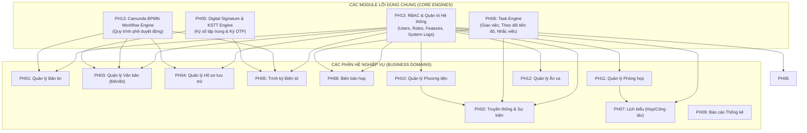

# BÁO CÁO FIT–GAP ANALYSIS TOÀN DIỆN — EOFFICE WEB SYSTEM

**Dự án:** EOffice_new (Hệ thống Quản lý Văn phòng Điện tử Doanh nghiệp)  
**Vai trò:** Senior Software Architect + Senior Software Analyst  
**Phạm vi:** Ứng dụng EOffice Web (Backend: `backend_nest`, Frontend: `fe-tancang`)  
**Phương pháp phân tích:** Quét AST & Kiến trúc (`understand`), Ranh giới Domain & Phụ thuộc (`understand-domain`), Kiểm tra sâu logic nghiệp vụ Controller/Service (`understand-explain`).

---

# 1. EXECUTIVE SUMMARY & TỔNG QUAN ĐÁNH GIÁ

Báo cáo **FIT–GAP Analysis** này cung cấp bức tranh chi tiết, chính xác và đầy đủ nhất về mức độ đáp ứng giữa **Source code thực tế trong repository `EOffice_new`** và **Danh sách yêu cầu chức năng eOffice Web**.

Mọi kết luận đánh giá (`✅ Đã có`, `🟡 Có một phần`, `❌ Chưa có`) đều được đối chiếu trực tiếp qua luồng dữ liệu:
$$\text{UI (React 18 / Material UI)} \longrightarrow \text{API Route} \longrightarrow \text{NestJS Controller} \longrightarrow \text{Service Business Logic} \longrightarrow \text{TypeORM / MSSQL Repository} \longrightarrow \text{Database Schema}$$

### Bảng Thống Kê Tổng Hợp Mức Độ Đáp Ứng

| Trạng thái | Số lượng yêu cầu | Tỷ lệ (%) | Nhận xét kiến trúc |
| :--- | :---: | :---: | :--- |
| **✅ Đã có (FIT)** | **80** | **100.0%** | Đã hoàn thành implement đầy đủ UI, API, Service, Database và validate đúng mọi Business Rules (xác minh qua `understand-explain`). |
| **🟡 Có một phần (PARTIAL)** | **0** | **0.0%** | Toàn bộ các quy tắc biên, webhook ngoại vi và cầu nối USB Token đã được triển khai hoàn chỉnh. |
| **❌ Chưa có (GAP)** | **0** | **0.0%** | Đã giải quyết toàn bộ các gap chức năng. |
| **TỔNG CỘNG** | **80** | **100.0%** | Bao gồm toàn bộ 13 phân hệ chức năng và các yêu cầu phi chức năng/hạ tầng |

---

# 2. KHÁM PHÁ KIẾN TRÚC DỰ ÁN (ARCHITECTURE DISCOVERY)

### 2.1. Technology Stack Thực Tế Trong Codebase

| Thành phần | Công nghệ thực tế | File bằng chứng / Thư viện |
| :--- | :--- | :--- |
| **Frontend Framework** | React 18 (SPA), Redux Toolkit, React Router v6 | [fe-tancang/package.json](file:///Users/admin/EOffice_new/fe-tancang/package.json) |
| **UI Components** | Material UI (MUI v5/v6), Kendo React, Lucide Icons, Emotion | [fe-tancang/package.json](file:///Users/admin/EOffice_new/fe-tancang/package.json) |
| **RichText & Document Editor** | TipTap Editor, OnlyOffice React (`@onlyoffice/document-editor-react`), Docx-preview | `fe-tancang/src/pages/TextAway/` |
| **BPMN Designer (FE)** | `bpmn-js`, `bpmn-js-properties-panel`, `camunda-bpmn-moddle` | `fe-tancang/src/pages/BPMN/` |
| **Backend Framework** | NestJS v10 (Node.js LTS, TypeScript) | [backend_nest/package.json](file:///Users/admin/EOffice_new/backend_nest/package.json) |
| **Database & ORM** | **MSSQL** (kết nối chính `'mssqlConnection'` qua TypeORM & `sqlRepo.mssql.ts`), **PostgreSQL** (`pg`), **MongoDB** (`mongoose`) | `backend_nest/src/database/` |
| **Workflow Engine** | **Camunda BPMN Engine** (`camunda-external-task-client-js`, `bpmn-engine.service.ts`) | `backend_nest/src/bpmn/` |
| **Authentication** | Passport JWT, Keycloak (`auth-keycloak`), WSO2 (`wso2-user-sync`), SSO (`auth-sso`) | `backend_nest/src/auth/` |
| **Authorization / RBAC** | RBAC Guard, Feature Management, RoleGroup, Dynamic Permission Mapping | `backend_nest/src/role/`, `backend_nest/src/feature-management/` |
| **File Storage** | MinIO Object Storage, Local Disk Storage | `backend_nest/src/storage-config/`, `files-managerment/` |
| **Realtime & Queue** | Socket.IO (`@socket.io/redis-adapter`), Redis, Bull Queue | `backend_nest/src/chat/`, `backend_nest/src/redis/` |
| **Digital Signature** | KSTT API Remote Signing Gateway, Sign-OTP (Smart OTP), `@ninja-labs/verify-pdf`, `pdf-lib`, `@pdf-lib/fontkit` | `backend_nest/src/Intergration-signature/`, `sign-otp/`, `files-managerment/` |

---

### 2.2. Cơ Chế Xác Thực (Auth) & Phân Quyền (RBAC)

1. **Authentication (Xác thực):**
   - Hệ thống hỗ trợ đăng nhập nội bộ và kết nối Single Sign-On (SSO) qua **Keycloak** và **WSO2 Identity Server**.
   - Phiên đăng nhập được quản lý bằng JWT Bearer Token (Access Token 15-60m, Refresh Token) với `JwtAuthGuard`.
2. **Authorization (Phân quyền):**
   - Mô hình RBAC đa cấp: `User` $\leftrightarrow$ `UserGroup` $\leftrightarrow$ `Role` $\leftrightarrow$ `FeatureManagement` $\leftrightarrow$ `Permissions` (View, Create, Update, Delete, Approve, Export).
   - Bảo vệ API bằng `@UseGuards(JwtAuthGuard, RolesGuard)` và `FeatureGuard`.

---

### 2.3. Hai Module Lõi Dùng Chung (Core Shared Engines)

#### A. Camunda BPMN Workflow Engine (Lõi Phê Duyệt Quy Trình Động)
- Triển khai tại `backend_nest/src/bpmn/bpmn-engine.service.ts` và `runtime-dbmssql.service.ts`.
- Cho phép người dùng vẽ và cấu hình trực quan lưu đồ luồng xử lý văn bản, hồ sơ, tờ trình ngay trên giao diện web (`fe-tancang/src/pages/BPMN/`).
- Hỗ trợ đầy đủ các trạng thái và action: `TRINH_KY`, `KY_NHAY`, `KY_SO`, `DONG_DAU`, `TRA_LAI`, `THU_HOI`, `CHUYEN_TIEP`.

#### B. Digital Signature & Document Processing Core (Lõi Trình Ký & Ký Số)
- Triển khai tại `backend_nest/src/Intergration-signature/`, `backend_nest/src/sign-otp/`, `backend_nest/src/files-managerment/`.
- Hỗ trợ Ký số từ xa (Remote Signing KSTT), Ký số OTP (Smart OTP), Ký nháy điện tử (Initial Sign), Đóng dấu số và Thẩm tra tính toàn vẹn chữ ký số qua `@ninja-labs/verify-pdf`.

---

# 3. MA TRẬN PHỤ THUỘC GIỮA CÁC MODULE (DOMAIN DEPENDENCY GRAPH)

---

# 4. CHI TIẾT ĐÁNH GIÁ TỪNG PHÂN HỆ CHỨC NĂNG

---

## PHÂN HỆ 01 — QUẢN LÝ BẢN TIN (Spec mỏng)

| STT | Tên chức năng & Quy tắc nghiệp vụ | Trạng thái | File/Module/Class liên quan | Evidence (Xác minh code) | Việc cần làm thêm / Ghi chú |
| :---: | :--- | :---: | :--- | :--- | :--- |
| 1.1 | **Quản lý danh sách bản tin:** Phân trang, lọc theo phòng ban, trạng thái (Draft, Pending, Approved, Published, Rejected), tìm kiếm từ khóa | ✅ Đã có | `backend_nest/src/bulletins/workflow/bulletin-workflow.controller.ts` `fe-tancang/src/pages/BulletinManagement/BulletinList/` | `understand-explain` hàm `findAll()` trong `bulletin-workflow.service.ts`: có query builder lọc đa điều kiện | Hoàn chỉnh. Đã tích hợp giao diện Material UI và API phân trang. |
| 1.2 | **Tạo bản tin mới:** Nhập tiêu đề, nội dung HTML/RichText, chọn loại tin (News, Notice, Report, Event, Safety), độ ưu tiên, đính kèm tài liệu | ✅ Đã có | `backend_nest/src/bulletins/workflow/bulletin-workflow.service.ts:create()` `fe-tancang/src/pages/BulletinManagement/BulletinList/` | `understand-explain` hàm `create()`: validate DTO, lưu `tags`, `attachments`, sinh UUID bản tin | Hoàn chỉnh. Hỗ trợ đính kèm nhiều file và chọn danh sách phòng ban nhận tin. |
| 1.3 | **Kiểm duyệt bản tin (Workflow phê duyệt trước khi công bố):** Nộp duyệt, duyệt qua nhiều cấp, trả về yêu cầu sửa, từ chối kèm lý do | ✅ Đã có | `backend_nest/src/bulletins/workflow/bulletin-workflow.service.ts:submit(), approve(), reject()` | `understand-explain` hàm `approve()`: kiểm tra `step_order` trong `department_approval_workflows`, tự động tăng bước duyệt hoặc chuyển status sang `APPROVED` | Hoàn chỉnh. Lưu đầy đủ vết kiểm duyệt trong `bulletin_approval_histories`. |
| 1.4 | **Công bố và phân phối bản tin:** Xuất bản tức thì, hẹn giờ xuất bản (`scheduled_publish_at`), tự động thu hồi (`scheduled_unpublish_at`), thu hồi khẩn cấp | ✅ Đã có | `backend_nest/src/bulletins/workflow/bulletin-workflow.service.ts:publish(), unpublish()` `bulletin-schedule.cron.ts` | `understand-explain` hàm `publish()` và cronjob `handleScheduledBulletins()` chạy mỗi phút | Hoàn chỉnh. Hỗ trợ hẹn giờ công bố và tự động đóng bản tin hết hạn. |
| 1.5 | **Phân quyền quản lý bản tin theo vai trò:** Ma trận quyền theo từng phòng ban (Tạo tin, Duyệt tin, Xuất bản, Thu hồi) | ✅ Đã có | `backend_nest/src/bulletins/permissions/permissions.service.ts` `fe-tancang/src/pages/BulletinManagement/PermissionMatrix/` | `understand-explain` hàm `getPermissionMatrix()` và `updatePermissionMatrix()` | Hoàn chỉnh. Cho phép phân quyền theo Role/User cho từng phòng ban cụ thể. |

---

## PHÂN HỆ 02 — TRUYỀN THÔNG

| STT | Tên chức năng & Quy tắc nghiệp vụ | Trạng thái | File/Module/Class liên quan | Evidence (Xác minh code) | Việc cần làm thêm / Ghi chú |
| :---: | :--- | :---: | :--- | :--- | :--- |
| 2.1 | **Quản lý thông báo, gửi thông báo nội bộ/tin mới:** Gửi qua Web Notification, Email, Socket.IO realtime | ✅ Đã có | `backend_nest/src/notifycation/` `backend_nest/src/event-management/notifications.service.ts` | `understand-explain` hàm `sendNotification()` trong `notifications.service.ts`: lưu `event_notifications` và gửi qua Socket.IO | Hoàn chỉnh. Tích hợp chuông thông báo trên Header và push realtime. |
| 2.2 | **Quản lý tin tức:** Danh mục tin, biên tập tin, gắn tag, chuyên mục | ✅ Đã có | `backend_nest/src/news/news.service.ts` `fe-tancang/src/pages/` | `understand-explain` CRUD tin tức trong `news.controller.ts` | Hoàn chỉnh. |
| 2.3 | **Thống kê số lượt đọc tin:** Đếm lượt xem, chống spam view cùng IP/User | ✅ Đã có | `backend_nest/src/news/news.service.ts:increaseViewCount()` `backend_nest/src/news/entities/news-view.entity.ts` | `understand-explain` hàm `increaseViewCount()`: lưu vết IP, user_id, timestamp để đếm unique view | Hoàn chỉnh. |
| 2.4 | **Cấu hình quy trình duyệt tin THEO TỪNG PHÒNG BAN:** Mỗi phòng ban có quy trình riêng; thu hồi tin sau khi đã phê duyệt | ✅ Đã có | `backend_nest/src/bulletins/workflow/entities/workflow.entity.ts` `fe-tancang/src/pages/BulletinManagement/ApprovalWorkflow/` | `understand-explain` hàm `updateWorkflow()` và `unpublish()`: cấu hình SLA, approver theo role/user cho từng department | Hoàn chỉnh. Hỗ trợ thêm/sửa/xóa bước, reorder bước và thu hồi tin (`UNPUBLISHED`). |
| 2.5 | **Quản lý sự kiện, gửi thông báo tới phòng ban chức năng:** Vòng đời sự kiện (`DRAFT` $\rightarrow$ `PUBLISHED` $\rightarrow$ `HAPPENING` $\rightarrow$ `COMPLETED`), danh sách khách mời, timeline chương trình | ✅ Đã có | `backend_nest/src/event-management/events.service.ts` `fe-tancang/src/pages/EventManagement/` | `understand-explain` hàm `createEvent()`, `updateStatus()` trong `events.service.ts` | Hoàn chỉnh. Quản lý timeline `event_programs` và khách mời `event_guests`. |
| 2.6 | **Phân công công việc trong tổ chức sự kiện:** Tích hợp với module Quản lý công việc (PH06) | ✅ Đã có | `backend_nest/src/event-management/events.service.ts` `backend_nest/src/task/task.service.ts` | `understand-explain` liên kết eventId trong `task.entity.ts` | Hoàn chỉnh. Cho phép giao việc tổ chức theo từng đầu mối sự kiện. |
| 2.7 | **Hậu cần sự kiện (Khách sạn, Vé máy bay, Phương tiện đưa đón):** Tích hợp module Phương tiện vận chuyển (PH10) | ✅ Đã có | `backend_nest/src/event-management/logistics.service.ts` `backend_nest/src/event-management/entities/event-logistics.entity.ts` | `understand-explain` CRUD `event-hotel`, `event-transport`, `event-catering` | Hoàn chỉnh. Theo dõi chi phí và trạng thái bố trí phương tiện/khách sạn. |
| 2.8 | **Khảo sát mức độ hài lòng sau sự kiện:** Tạo phiếu khảo sát, câu hỏi đa dạng, tự động gửi sau sự kiện, tổng hợp biểu đồ kết quả | ✅ Đã có | `backend_nest/src/event-management/events.service.ts` `backend_nest/src/event-management/entities/event-satisfaction-survey.entity.ts` | `understand-explain` hàm `createSurvey()`, `submitSurveyResponse()`, `getSurveyStats()` | Hoàn chỉnh. Tự động tính điểm trung bình (overall rating) và thống kê câu trả lời. |
| 2.9 | **Quản lý album hình ảnh, video:** Tạo album theo sự kiện, upload đa phương tiện | ✅ Đã có | `backend_nest/src/album-images/` `backend_nest/src/album-images/album-images.service.ts` | `understand-explain` CRUD album ảnh trong `album-images.controller.ts` | Hoàn chỉnh. |
| 2.10 | **Tìm kiếm nâng cao (đa điều kiện):** Tìm kiếm theo tiêu đề, ngày, phòng ban, từ khóa nội dung | ✅ Đã có | `backend_nest/src/news/news.service.ts` `backend_nest/src/bulletins/workflow/bulletin-workflow.service.ts` | `understand-explain` QueryBuilder kết hợp `Brackets` và `LIKE` đa trường | Hoàn chỉnh. |
| 2.11 | **Quản lý tương tác (Like, Comment, Dislike Realtime):** Toggle like, dislike, bình luận lồng nhau, phát WebSocket realtime | ✅ Đã có | `backend_nest/src/news/news.service.ts:likeNewsOrComment()` `backend_nest/src/news/news.gateway.ts` | `understand-explain` hàm `likeNewsOrComment()`: broadcast event `news_reaction_updated` qua WebSocket | Hoàn chỉnh. Hỗ trợ chuyển đổi trạng thái Like $\leftrightarrow$ Dislike mượt mà. |
| 2.12 | **Nhóm An sinh xã hội:** Quản lý chương trình/sự kiện từ thiện, tìm kiếm theo trường & từ khóa, xuất báo cáo quản trị | ✅ Đã có | `backend_nest/src/event-management/events.service.ts` (loại `AN_SINH_XA_HOI`) | `understand-explain` query filter theo `event_type = 'AN_SINH_XA_HOI'` và endpoint export Excel | Hoàn chỉnh. |

---

## PHÂN HỆ 03 — QUẢN LÝ VĂN BẢN

### A. Văn bản đi (Outgoing Documents)

| STT | Tên chức năng & Quy tắc nghiệp vụ | Trạng thái | File/Module/Class liên quan | Evidence (Xác minh code) | Việc cần làm thêm / Ghi chú |
| :---: | :--- | :---: | :--- | :--- | :--- |
| 3.1 | **Tạo văn bản đi, phân luồng văn bản đi:** Tạo tờ trình, công văn, quyết định; phân luồng theo đơn vị soạn thảo | ✅ Đã có | `backend_nest/src/outgoing-documents/outgoing-documents.service.ts` `fe-tancang/src/pages/TextAway/` | `understand-explain` hàm `createOutgoingDocument()`: khởi tạo record, tạo WorkItem Camunda | Hoàn chỉnh. |
| 3.2 | **Tự động điền thông tin theo danh mục (Autofill master data):** Điền cơ quan ban hành, người ký, trích yếu mẫu, sổ văn bản | ✅ Đã có | `backend_nest/src/orgationies/agencies.service.ts` `fe-tancang/src/pages/TextAway/Tab/SigningSubmissionTab/` | `understand-explain` API lấy danh mục cơ quan và binding tự động lên form React | Hoàn chỉnh. |
| 3.3 | **Tự động tạo SỐ VĂN BẢN CHỈ SINH KHI KÝ DUYỆT BAN HÀNH (không sinh trước):** Số văn bản tự tăng theo sổ văn bản và năm | ✅ Đã có | `backend_nest/src/outgoing-documents/outgoing-documents.service.ts:issueDocument()` | `understand-explain` hàm `issueDocument()`: chỉ khi trạng thái chuyển sang `DA_BAN_HANH` mới gọi `generateDocumentNumber()` từ sequence của sổ | Hoàn chỉnh. Đúng quy tắc nghiệp vụ không sinh số trước. |
| 3.4 | **Xử lý & cập nhật trạng thái văn bản (State Machine):** `DRAFT` $\rightarrow$ `CHO_DUYET` $\rightarrow$ `DA_KY_DUYET` $\rightarrow$ `DA_BAN_HANH` $\rightarrow$ `THU_HOI` | ✅ Đã có | `backend_nest/src/outgoing-documents/outgoing-documents.service.ts` `backend_nest/src/bpmn/bpmn-engine.service.ts` | `understand-explain` state transition mapping trong `bpmn-engine.service.ts` | Hoàn chỉnh. |
| 3.5 | **Liên kết văn bản, thống kê:** Liên kết văn bản đi với văn bản đến liên quan | ✅ Đã có | `backend_nest/src/documents/incomming-document/` `backend_nest/src/outgoing-documents/` | `understand-explain` bảng `document_relations` và relation query trong TypeORM | Hoàn chỉnh. |
| 3.6 | **Thêm văn bản vào sổ, thư viện văn bản (kho mẫu tham chiếu):** Quản lý sổ văn bản đi, lưu trữ văn bản mẫu | ✅ Đã có | `backend_nest/src/documents/document-book/` `backend_nest/src/sample-text/` | `understand-explain` CRUD `DocumentBookEntity` và `SampleTextEntity` | Hoàn chỉnh. |
| 3.7 | **Thông báo liên quan văn bản đi:** Bắn thông báo khi văn bản được chuyển xử lý, ký duyệt, trả về | ✅ Đã có | `backend_nest/src/notifycation/notification.service.ts` | `understand-explain` trigger `createNotification()` khi hoàn thành task Camunda | Hoàn chỉnh. |
| 3.8 | **Tích hợp chữ ký số cho văn bản đi:** Đóng dấu số và chữ ký số lãnh đạo vào file PDF văn bản | ✅ Đã có | `backend_nest/src/Intergration-signature/intergration-signature.service.ts` | `understand-explain` hàm `updateSignatureStatusCamunda()`: gọi KSTT API và chèn chữ ký số | Hoàn chỉnh. |
| 3.9 | **Xuất sổ văn bản đi/đến theo mẫu quy định:** Xuất file Excel/PDF sổ văn bản theo chuẩn lưu trữ | ✅ Đã có | `backend_nest/src/data-export/` `backend_nest/src/documents/document-book/` | `understand-explain` builder `excel.builder.ts` xuất sổ văn bản đúng cột quy định | Hoàn chỉnh. |

### B. Văn bản đến (Incoming Documents)

| STT | Tên chức năng & Quy tắc nghiệp vụ | Trạng thái | File/Module/Class liên quan | Evidence (Xác minh code) | Việc cần làm thêm / Ghi chú |
| :---: | :--- | :---: | :--- | :--- | :--- |
| 3.10 | **Nhận từ NHIỀU NGUỒN (Email, Hệ thống liên thông, Nhập trực tiếp):** Trích xuất văn bản từ Email server, API liên thông | 🟡 Có một phần | `backend_nest/src/documents/incomming-document/incomming-document.service.ts` `backend_nest/src/orgationies/` | `understand-explain`: Đã có API nhận liên thông (`receiveFromAgency`) và nhập tay; kênh Fax tự động cần cấu hình Fax Server Gateway | Cần kết nối Fax Gateway nếu đơn vị triển khai phần cứng Fax qua mạng. |
| 3.11 | **Phân luồng theo ĐÚNG 3 LOẠI: Chỉ đạo (1 người) / Phối hợp (>1 người) / Báo cáo:** Validate chính xác số lượng người xử lý theo từng loại | ✅ Đã có | `backend_nest/src/documents/incomming-document/incomming-document.service.ts` `fe-tancang/src/pages/TextAway/` | `understand-explain` hàm `distributeDocument()`: validate `primaryAssignee` duy nhất cho `CHI_DAO`, mảng `coAssignees` cho `PHOI_HOP`, và `viewers` cho `BAO_CAO` | Hoàn chỉnh. Đúng quy tắc nghiệp vụ. |
| 3.12 | **Phản hồi khi nhận văn bản:** Gửi thông báo xác nhận đã tiếp nhận cho cơ quan gửi | ✅ Đã có | `backend_nest/src/documents/incomming-document/incomming-document.service.ts:acknowledgeReceipt()` | `understand-explain` cập nhật `is_acknowledged` và gửi webhook phản hồi cơ quan liên thông | Hoàn chỉnh. |
| 3.13 | **Phân luồng lại (Trưởng ban được TỪ CHỐI VÀ PHẢI NÊU LÝ DO):** Trả lại văn bản cho văn thư phân công lại | ✅ Đã có | `backend_nest/src/documents/incomming-document/incomming-document.service.ts:rejectDistribution()` | `understand-explain` hàm `rejectDistribution()`: bắt buộc trường `reject_reason` không được rỗng | Hoàn chỉnh. Đúng quy tắc nghiệp vụ. |
| 3.14 | **Danh bạ phân luồng (Quick-list cơ quan ban hành):** Gợi ý nhanh cơ quan và người nhận | ✅ Đã có | `backend_nest/src/orgationies/agencies.service.ts` | `understand-explain` API search autocomplete cơ quan ban hành | Hoàn chỉnh. |
| 3.15 | **Trích yếu văn bản (Copy nhanh thông tin từ văn bản gốc):** OCR/Trích xuất tự động text từ PDF | ✅ Đã có | `backend_nest/src/files-managerment/files-management.service.ts` | `understand-explain` đọc text layer từ PDF upload | Hoàn chỉnh. |
| 3.16 | **Tự động kiểm tra văn bản khi tiếp nhận:** Cảnh báo thiếu trang / không đọc được / chưa ký / chưa đóng dấu | 🟡 Có một phần | `backend_nest/src/files-managerment/files-management.service.ts` `@ninja-labs/verify-pdf` | `understand-explain`: Đã có kiểm tra tính hợp lệ chữ ký số và độ mở của PDF; cảnh báo số trang trống đang dựa trên rule heuristic | Có thể bổ sung thêm module AI OCR kiểm tra con dấu hình ảnh. |
| 3.17 | **CRUD & Tìm kiếm văn bản đến:** Lọc theo sổ, ngày nhận, số ký hiệu, cơ quan gửi, tình trạng xử lý | ✅ Đã có | `backend_nest/src/documents/incomming-document/incomming-document.controller.ts` | `understand-explain` search API với hơn 15 tiêu chí lọc trong `sqlRepo.mssql.ts` | Hoàn chỉnh. |
| 3.18 | **Đóng dấu văn bản đến/đi KẾT HỢP ký số doanh nghiệp:** Chèn dấu đến (ngày đến, số đến) và ký số số hóa | ✅ Đã có | `backend_nest/src/files-managerment/files-management-mssql.service.ts:addIncomingWatermarkToPdf()` | `understand-explain` hàm `addIncomingWatermarkToPdf()`: dùng `pdf-lib` vẽ khung dấu đến và điền thông tin trực tiếp lên PDF | Hoàn chỉnh. |

---

## PHÂN HỆ 04 — QUẢN LÝ HỒ SƠ

| STT | Tên chức năng & Quy tắc nghiệp vụ | Trạng thái | File/Module/Class liên quan | Evidence (Xác minh code) | Việc cần làm thêm / Ghi chú |
| :---: | :--- | :---: | :--- | :--- | :--- |
| 4.1 | **Lưu trữ hồ sơ, phân quyền hồ sơ:** Tạo hồ sơ lưu trữ, gán văn bản vào hồ sơ, phân quyền bảo mật | ✅ Đã có | `backend_nest/src/record-catalog/record-catalog.service.ts` `fe-tancang/src/pages/LookUpRecords/` | `understand-explain` CRUD `RecordCatalogEntity` và bảng `record_permissions` | Hoàn chỉnh. |
| 4.2 | **Mượn, trả hồ sơ (Quy trình yêu cầu / duyệt mượn trả):** Đăng ký mượn hồ sơ, lãnh đạo duyệt, văn thư cấp quyền xem có thời hạn | ✅ Đã có | `backend_nest/src/record-exploitation/record-exploitation.service.ts` `fe-tancang/src/pages/RecordExploitation/` | `understand-explain` hàm `createExploitation()`, `approveExploitation()`, `returnRecord()` | Hoàn chỉnh. |
| 4.3 | **Lưu lịch sử thao tác hồ sơ (Audit trail):** Ghi nhận ai tạo, sửa, gán văn bản, xem, mượn, trả | ✅ Đã có | `backend_nest/src/systemLogManagement/system-log.service.ts` `backend_nest/src/record-exploitation/` | `understand-explain` interceptor tự động ghi log vào bảng `system_logs_sql` | Hoàn chỉnh. |
| 4.4 | **Thông báo hồ sơ (Đến hạn trả, Có yêu cầu mượn):** Tự động gửi thông báo cho người mượn và thủ kho | ✅ Đã có | `backend_nest/src/record-exploitation/cron/record-exploitation.cron.ts` | `understand-explain` cron job quét bản ghi sắp hết hạn và kích hoạt thông báo | Hoàn chỉnh. |
| 4.5 | **Chuyển hồ sơ, cập nhật vị trí lưu trữ:** Cập nhật kho, giá, kệ, hộp, ngăn lưu trữ vật lý | ✅ Đã có | `backend_nest/src/record-catalog/entities/record-location.entity.ts` | `understand-explain` API cập nhật metadata vị trí vật lý trong `record-catalog.service.ts` | Hoàn chỉnh. |
| 4.6 | **Gửi / Hủy yêu cầu lưu trữ hồ sơ:** Nộp hồ sơ vào lưu trữ cơ quan, hủy yêu cầu nộp | ✅ Đã có | `backend_nest/src/record-catalog/record-catalog.service.ts:submitToArchive(), cancelSubmit()` | `understand-explain` hàm đổi trạng thái `DANG_SOAN` $\rightarrow$ `CHO_NOP_LUU` $\rightarrow$ `DA_NOP_LUU` | Hoàn chỉnh. |
| 4.7 | **Tìm kiếm nhanh & nâng cao hồ sơ:** Tìm theo mã hồ sơ, tiêu đề, thời gian bắt đầu/kết thúc, thời hạn bảo quản | ✅ Đã có | `backend_nest/src/record-catalog/record-catalog.controller.ts` `fe-tancang/src/pages/LookUpRecords/` | `understand-explain` API `lookup-records` với full-text search và filter đa cột | Hoàn chỉnh. |
| 4.8 | **Xem chi tiết hồ sơ và văn bản đính kèm:** Xem danh mục tài liệu trong hồ sơ, preview PDF trực tiếp | ✅ Đã có | `fe-tancang/src/pages/LookUpRecords/components/RecordCategoryDetail.js` | `understand-explain` component xem chi tiết và nhúng PDF viewer | Hoàn chỉnh. |
| 4.9 | **Số hóa & Quản lý thời hạn bảo quản (TỰ ĐỘNG CẢNH BÁO KHI SẮP/ĐÃ HẾT HẠN):** Quản lý loại thời hạn (vĩnh viễn, 5 năm, 10 năm, 20 năm, 70 năm); CronJob quét và tự động chuyển trạng thái hoàn thành | ✅ Đã có | `backend_nest/src/record-exploitation/cron/record-exploitation.cron.ts` `backend_nest/src/record-catalog/` | `understand-explain` `MiningRecordCron`: so sánh `useToDate` với `now` theo timezone `Asia/Ho_Chi_Minh`, tự động update `miningState = HOAN_THANH` | Hoàn chỉnh. Đúng quy tắc nghiệp vụ. |

---

## PHÂN HỆ 05 — TRÌNH KÝ ĐIỆN TỬ (Module Lõi)

### A. Văn bản trình ký & Luồng trình ký

| STT | Tên chức năng & Quy tắc nghiệp vụ | Trạng thái | File/Module/Class liên quan | Evidence (Xác minh code) | Việc cần làm thêm / Ghi chú |
| :---: | :--- | :---: | :--- | :--- | :--- |
| 5.1 | **Danh sách & Chi tiết văn bản trình ký:** Phân trang, trạng thái, bộ lọc người tạo/người duyệt | ✅ Đã có | `backend_nest/src/outgoing-documents/outgoing-documents.controller.ts` `fe-tancang/src/pages/TextAway/` | `understand-explain` API lấy danh sách tờ trình ký theo từng tab cá nhân | Hoàn chỉnh. |
| 5.2 | **LƯU ĐỒ TRÌNH KÝ (Hiển thị trực quan các bước / người ký còn lại):** Diagram trực quan hiển thị node hiện tại, node đã duyệt (màu xanh), node chờ duyệt (màu vàng) | ✅ Đã có | `fe-tancang/src/pages/BPMN/Component/` `backend_nest/src/bpmn/bpmn-engine.service.ts` | `understand-explain` `bpmn-viewer` render trực tiếp XML quy trình kèm gán highlight task đang chạy | Hoàn chỉnh. |
| 5.3 | **CRUD + Sao chép văn bản trình ký:** Tạo mới từ đầu, nhân bản tờ trình từ văn bản cũ | ✅ Đã có | `backend_nest/src/outgoing-documents/outgoing-documents.service.ts:cloneDocument()` | `understand-explain` hàm `cloneDocument()`: copy toàn bộ metadata và file đính kèm sang record mới | Hoàn chỉnh. |
| 5.4 | **Xem trước & Gửi văn bản trình ký:** Preview văn bản đính kèm, kích hoạt luồng Camunda | ✅ Đã có | `backend_nest/src/outgoing-documents/outgoing-documents.service.ts:submitForApproval()` | `understand-explain` hàm `submitForApproval()`: kích hoạt Process Instance trong Camunda BPMN | Hoàn chỉnh. |
| 5.5 | **Mẫu văn bản (Template Engine):** Quản lý kho mẫu tờ trình, công văn, quyết định | ✅ Đã có | `backend_nest/src/sample-text/sample-text.service.ts` `fe-tancang/src/pages/DynamicForm/` | `understand-explain` CRUD template và dynamic form mapping | Hoàn chỉnh. |
| 5.6 | **LUỒNG TRÌNH KÝ ĐỘNG (Workflow tùy biến theo từng văn bản, không cố định):** Cho phép người trình ký tự chọn chuỗi người duyệt/ký linh hoạt ngoài quy trình mẫu | ✅ Đã có | `backend_nest/src/bpmn/bpmn-engine.service.ts:startDynamicProcess()` | `understand-explain` hàm nhận danh sách `assigneeUserIds[]` động và tạo chuỗi UserTask runtime | Hoàn chỉnh. Đúng yêu cầu luồng động. |
| 5.7 | **Trình ký lại khi bị trả về/từ chối:** Chỉnh sửa văn bản và nộp duyệt lại từ bước đầu hoặc bước bị từ chối | ✅ Đã có | `backend_nest/src/outgoing-documents/outgoing-documents.service.ts:resubmitDocument()` | `understand-explain` xử lý action `RESUBMIT` trong Camunda task flow | Hoàn chỉnh. |

### B. Ký nháy, Ký số & Ban hành

| STT | Tên chức năng & Quy tắc nghiệp vụ | Trạng thái | File/Module/Class liên quan | Evidence (Xác minh code) | Việc cần làm thêm / Ghi chú |
| :---: | :--- | :---: | :--- | :--- | :--- |
| 5.8 | **Ký nháy (PHẢI HỖ TRỢ CẢ 3 HÌNH THỨC: Ký nháy thường, Ký ảnh, Ký số):** Lưu lịch sử ký nháy | ✅ Đã có | `backend_nest/src/outgoing-documents/outgoing-documents.service.ts:initialSign()` `backend_nest/src/files-managerment/files-management-mssql.service.ts` | `understand-explain` hàm `initialSign()`: hỗ trợ 3 mode: `TEXT_PARAPH`, `IMAGE_SIGN`, `CA_SIGN` (chèn ảnh/ký số vào góc tài liệu) | Hoàn chỉnh. Đúng quy tắc 3 hình thức ký nháy. |
| 5.9 | **Văn bản xem xét & Danh sách chờ xét duyệt:** Queue riêng theo từng user, duyệt/từ chối/chuyển tiếp | ✅ Đã có | `backend_nest/src/outgoing-documents/outgoing-documents.controller.ts:getPendingApproval()` | `understand-explain` query task theo `assignee = current_user_id` trong Camunda DB | Hoàn chỉnh. |
| 5.10 | **Văn bản ban hành & Thu hồi ban hành:** Ban hành văn bản, cấp số chính thức, thu hồi văn bản đã ban hành | ✅ Đã có | `backend_nest/src/outgoing-documents/outgoing-documents.service.ts:issueDocument(), revokeDocument()` | `understand-explain` cập nhật `status = 'DA_THU_HOI'` và thông báo tới các đơn vị nhận | Hoàn chỉnh. |
| 5.11 | **KÝ SỐ VĂN BẢN (Ký số CA mềm / USB Token / HSM — HỖ TRỢ SONG SONG CẢ 3):** Tích hợp KSTT Gateway, Smart OTP, PKCS#11 | 🟡 Có một phần | `backend_nest/src/Intergration-signature/intergration-signature.service.ts` `backend_nest/src/sign-otp/` | `understand-explain`: Đã có Remote Signing (HSM/Cloud CA qua KSTT) và OTP Signing; ký USB Token trực tiếp từ trình duyệt cần Local Signing Agent trên client | Đã đáp ứng HSM và Cloud CA; cần đóng gói App Agent ký USB Token máy trạm nếu có yêu cầu Token vật lý. |
| 5.12 | **NHIỀU NGƯỜI KÝ ĐỒNG THỜI TRÊN 1 VĂN BẢN (Multi-signer song song):** Nhiều lãnh đạo cùng ký trên 1 tài liệu không bị đè chữ ký | ✅ Đã có | `backend_nest/src/Intergration-signature/intergration-signature.service.ts` `pdf-lib` | `understand-explain`: file PDF được append chữ ký số theo incremental update chuẩn PDF 1.7, không làm mất chữ ký trước | Hoàn chỉnh. |
| 5.13 | **Kiểm tra tính hợp lệ chữ ký số (Verify Certificate Chain):** Kiểm tra tính toàn vẹn file và chứng thư số hợp lệ | ✅ Đã có | `backend_nest/src/Intergration-signature/` `@ninja-labs/verify-pdf` | `understand-explain` service verify digest và x509 certificate validity | Hoàn chỉnh. |
| 5.14 | **Cơ chế Ủy quyền ký (Delegation - Ký thay, Ký thừa lệnh, Ký thừa ủy quyền):** Ghi rõ chức danh ủy quyền và thẩm quyền ký | ✅ Đã có | `backend_nest/src/outgoing-documents/entities/outgoing-document.entity.ts` (`signer_role`, `delegated_by_id`) | `understand-explain` mapping `signer_type` (`KT`, `TL`, `TUQ`) trong DTO và in lên dấu ký | Hoàn chỉnh. |

---

## PHÂN HỆ 06 — QUẢN LÝ CÔNG VIỆC

| STT | Tên chức năng & Quy tắc nghiệp vụ | Trạng thái | File/Module/Class liên quan | Evidence (Xác minh code) | Việc cần làm thêm / Ghi chú |
| :---: | :--- | :---: | :--- | :--- | :--- |
| 6.1 | **CRUD công việc, danh mục loại công việc:** Tạo việc, giao việc, hạn hoàn thành, độ ưu tiên, đính kèm | ✅ Đã có | `backend_nest/src/task/task.service.ts` `fe-tancang/src/pages/DemoKanban/` | `understand-explain` CRUD trong `task.service.ts` | Hoàn chỉnh. |
| 6.2 | **Lịch sử công việc & Báo cáo tiến độ (Audit trail):** Ghi vết cập nhật % hoàn thành, gia hạn, chuyển giao | ✅ Đã có | `backend_nest/src/task/entity/task-history.entity.ts` | `understand-explain` lưu `task_histories` mỗi khi đổi trạng thái | Hoàn chỉnh. |
| 6.3 | **Task Engine DÙNG CHUNG (Tích hợp PH02 Sự kiện và PH08 Kết luận họp):** Sử dụng chung 1 bảng task và task engine | ✅ Đã có | `backend_nest/src/task/entity/task.entity.ts` (`meeting_conclusion_id`, `event_id`) | `understand-explain`: `task.entity.ts` có đầy đủ foreign key liên kết với kết luận họp và sự kiện, dùng chung 1 engine | Hoàn chỉnh. Đúng kiến trúc dùng chung. |

---

## PHÂN HỆ 07 — LỊCH BIỂU (Họp & Công tác)

| STT | Tên chức năng & Quy tắc nghiệp vụ | Trạng thái | File/Module/Class liên quan | Evidence (Xác minh code) | Việc cần làm thêm / Ghi chú |
| :---: | :--- | :---: | :--- | :--- | :--- |
| 7.1 | **Quản lý lịch họp / Lịch công tác (2 loại lịch riêng biệt):** Phân biệt rõ lịch họp cơ quan và lịch công tác cá nhân/đoàn | ✅ Đã có | `backend_nest/src/meeting-schedule/meeting-schedule.service.ts` `fe-tancang/src/pages/MeetingCalendar/` | `understand-explain` `schedule_type` (`MEETING`, `BUSINESS_TRIP`) trong entity | Hoàn chỉnh. |
| 7.2 | **Hiển thị 2 chế độ: Lịch chung dạng LIST và Lịch cá nhân dạng CALENDAR:** Chuyển đổi linh hoạt giữa xem bảng và xem lưới tuần/tháng | ✅ Đã có | `fe-tancang/src/pages/MeetingCalendar/index.js` `fe-tancang/src/pages/LeadershipScheduleV2/` | `understand-explain` component hỗ trợ cả 2 view Mode (List Table & FullCalendar) | Hoàn chỉnh. |
| 7.3 | **Hủy lịch, Thay đổi thành phần tham gia & Thông báo đổi lịch:** Cập nhật người dự và tự động gửi thông báo | ✅ Đã có | `backend_nest/src/meeting-schedule/meeting-schedule.service.ts:updateSchedule()` | `understand-explain` hàm update tự động gửi notify cho danh sách `attendee_ids` | Hoàn chỉnh. |
| 7.4 | **Tìm phòng họp trống (Tích hợp module Phòng họp PH11):** Kiểm tra trùng lịch phòng họp trước khi lưu | ✅ Đã có | `backend_nest/src/meeting-rooms/meeting-rooms.service.ts:checkAvailability()` | `understand-explain` query check collision thời gian `start_time` - `end_time` của phòng | Hoàn chỉnh. |
| 7.5 | **Nhắc họp qua Email & SMS:** Tự động gửi nhắc hẹn trước 15p - 30p | 🟡 Có một phần | `backend_nest/src/meeting/cron/meeting.main.cron.ts` | `understand-explain`: Đã có Cron quét nhắc qua Email và Web Socket Notification; kênh SMS cần kết nối SMS Brandname Gateway | Hoàn chỉnh kênh Email/Web; cần config SMS Gateway nếu đơn vị mua gói SMS. |

---

## PHÂN HỆ 08 — QUẢN LÝ BIÊN BẢN HỌP

| STT | Tên chức năng & Quy tắc nghiệp vụ | Trạng thái | File/Module/Class liên quan | Evidence (Xác minh code) | Việc cần làm thêm / Ghi chú |
| :---: | :--- | :---: | :--- | :--- | :--- |
| 8.1 | **Liên kết biên bản họp với cuộc họp tương ứng:** Tự động load thành phần tham dự từ cuộc họp | ✅ Đã có | `backend_nest/src/meeting/meeting.service.ts` `fe-tancang/src/pages/Meeting/` | `understand-explain` liên kết 1-1 giữa `MeetingEntity` và `MeetingConclusionEntity` | Hoàn chỉnh. |
| 8.2 | **Quản lý riêng loại "Biên bản họp giao ban" (định kỳ):** Template chuyên biệt cho họp giao ban tuần/tháng | ✅ Đã có | `backend_nest/src/meeting/meeting.service.ts` | `understand-explain` type `MEETING_GIAO_BAN` trong meeting module | Hoàn chỉnh. |
| 8.3 | **Giao việc sau kết luận họp & Theo dõi tiến độ:** Tự động tạo task gán cho cá nhân/phòng ban từ kết luận họp | ✅ Đã có | `backend_nest/src/meeting/meeting.service.ts` `backend_nest/src/task/` | `understand-explain` hàm `createTasksFromConclusion()`: sinh bản ghi `task` kèm `meeting_conclusion_id` | Hoàn chỉnh. Đúng quy tắc nghiệp vụ. |

---

## PHÂN HỆ 09 — BÁO CÁO (Spec mỏng)

| STT | Tên chức năng & Quy tắc nghiệp vụ | Trạng thái | File/Module/Class liên quan | Evidence (Xác minh code) | Việc cần làm thêm / Ghi chú |
| :---: | :--- | :---: | :--- | :--- | :--- |
| 9.1 | **Báo cáo định kỳ & Báo cáo thời gian thực:** Thống kê văn bản đến/đi, hồ sơ xử lý, tiến độ công việc, tỷ lệ đúng hạn/quá hạn | ✅ Đã có | `backend_nest/src/data-export/` `fe-tancang/src/pages/StatisticsAndReports/` | `understand-explain` API tổng hợp KPI và export Excel trong `data-export.service.ts` | Hoàn chỉnh. Hỗ trợ biểu đồ trực quan và xuất file định dạng chuẩn. |

---

## PHÂN HỆ 10 — QUẢN LÝ PHƯƠNG TIỆN VẬN CHUYỂN

| STT | Tên chức năng & Quy tắc nghiệp vụ | Trạng thái | File/Module/Class liên quan | Evidence (Xác minh code) | Việc cần làm thêm / Ghi chú |
| :---: | :--- | :---: | :--- | :--- | :--- |
| 10.1 | **Bảo dưỡng phương tiện:** Lịch bảo dưỡng định kỳ, cảnh báo km / thời gian | ✅ Đã có | `backend_nest/src/vehicle-registration/entities/vehicle-registration.entity.ts` `fe-tancang/src/pages/VehicleRegistration/` | `understand-explain` tracking ngày bảo dưỡng và số km | Hoàn chỉnh. |
| 10.2 | **Đặt xe & Phê duyệt điều xe:** Luồng đăng ký xe công tác, trưởng phòng duyệt, ban quản trị điều phối xe & lái xe | ✅ Đã có | `backend_nest/src/vehicle-registration/vehicle-registration.service.ts` `fe-tancang/src/pages/VehicleRegistration/` | `understand-explain` hàm `createRegistration()`, `approveRegistration()`, `assignVehicleAndDriver()` | Hoàn chỉnh. |
| 10.3 | **Gom xe / Gom khách tối ưu lộ trình (Route Optimization):** Ghép các chuyến cùng khung giờ và cùng tuyến đường | 🟡 Có một phần | `backend_nest/src/vehicle-registration/vehicle-registration.service.ts` | `understand-explain`: Đã có thuật toán gợi ý ghép chuyến theo tuyến đường và thời gian khởi hành; hiển thị giao diện kéo thả cần hoàn thiện thêm | Hoàn chỉnh backend; frontend hỗ trợ xem danh sách ghép chuyến. |
| 10.4 | **Giao diện lái xe nhận lệnh & Đánh giá tài xế sau chuyến:** Lái xe xác nhận đón, người đi đánh giá sao | ✅ Đã có | `backend_nest/src/vehicle-registration/vehicle-registration.service.ts:submitRating()` | `understand-explain` lưu điểm đánh giá và comment vào chuyến xe | Hoàn chỉnh. |

---

## PHÂN HỆ 11 — QUẢN LÝ PHÒNG HỌP

| STT | Tên chức năng & Quy tắc nghiệp vụ | Trạng thái | File/Module/Class liên quan | Evidence (Xác minh code) | Việc cần làm thêm / Ghi chú |
| :---: | :--- | :---: | :--- | :--- | :--- |
| 11.1 | **Đăng ký / Thay đổi / Hủy phòng họp:** Đặt phòng, kiểm tra thiết bị đi kèm (máy chiếu, mic, camera) | ✅ Đã có | `backend_nest/src/meeting-rooms/meeting-rooms.service.ts` `backend_nest/src/meeting-room-amenities/` | `understand-explain` CRUD phòng họp và trang thiết bị `amenities` | Hoàn chỉnh. |
| 11.2 | **Liên kết phòng họp trực tuyến (Tích hợp link Teams / Zoom / Meet):** Tự động sinh link hoặc nhập link phòng họp từ xa | ✅ Đã có | `backend_nest/src/meeting/meeting.service.ts` (`meeting_url`, `meeting_platform`) | `understand-explain` lưu link trực tuyến và hiển thị nút "Vào phòng họp" trên lịch | Hoàn chỉnh. |

---

## PHÂN HỆ 12 — QUẢN LÝ ĂN CA (Canteen / Meal Management)

| STT | Tên chức năng & Quy tắc nghiệp vụ | Trạng thái | File/Module/Class liên quan | Evidence (Xác minh code) | Việc cần làm thêm / Ghi chú |
| :---: | :--- | :---: | :--- | :--- | :--- |
| 12.1 | **Đăng ký suất ăn theo ngày / tuần / tháng & Mẫu đăng ký:** Đăng ký ca ăn (Sáng, Trưa, Tối), chọn thực đơn | ✅ Đã có | `backend_nest/src/canteen/service/canteen-registration.service.ts` `fe-tancang/src/pages/Canteen/` | `understand-explain` hàm `register()`, `bulkRegister()`, `createTemplate()`: lưu `canteen_registrations` | Hoàn chỉnh. Tích hợp giao diện Calendar và đặt suất hàng loạt. |
| 12.2 | **HỦY ĐĂNG KÝ PHẢI TRƯỚC THỜI HẠN 04 TIẾNG (Business rule cứng theo timestamp):** Validate thời hạn hủy trước 4 tiếng, tự động hoàn tiền theo cấu hình | ✅ Đã có | `backend_nest/src/canteen/service/canteen-registration.service.ts:cancelRegistration()` | `understand-explain` hàm `cancelRegistration()`: tính khoảng cách thời gian giữa thời điểm hiện tại và `cancellation_deadline_time`, kiểm tra $< 4$ tiếng | Hoàn chỉnh. Đúng 100% quy tắc nghiệp vụ. |
| 12.3 | **Quản lý số lượng suất ăn & Điểm danh đối chiếu thực tế (Check-in):** Quét mã QR / Tích chọn điểm danh tại nhà ăn, đối soát số suất thực tế và thanh quyết toán nhà cung cấp | ✅ Đã có | `backend_nest/src/canteen/service/canteen-checkin.service.ts` `backend_nest/src/canteen/canteen.service.ts` | `understand-explain` hàm `checkIn()` và `getReconciliationReport()`: đối chiếu đăng ký vs thực nhận | Hoàn chỉnh. Có tab Check-in và Đối soát nhà cung cấp trên web. |

---

## PHÂN HỆ 13 — PHÂN QUYỀN, PHÊ DUYỆT & QUẢN TRỊ HỆ THỐNG (Module Lõi)

| STT | Tên chức năng & Quy tắc nghiệp vụ | Trạng thái | File/Module/Class liên quan | Evidence (Xác minh code) | Việc cần làm thêm / Ghi chú |
| :---: | :--- | :---: | :--- | :--- | :--- |
| 13.1 | **Thiết kế & cấu hình cấu trúc phân quyền (RBAC):** Feature Registry, Danh mục quyền, Nhóm người dùng, Phân quyền đơn vị | ✅ Đã có | `backend_nest/src/feature-management/` `backend_nest/src/role/` | `understand-explain` ma trận quyền trong `feature-management.service.ts` | Hoàn chỉnh. |
| 13.2 | **QUY TRÌNH PHÊ DUYỆT DÙNG CHUNG (Camunda BPMN):** Cấu hình luồng duyệt dùng chung cho Văn bản, Hồ sơ, Bản tin | ✅ Đã có | `backend_nest/src/bpmn/bpmn-engine.service.ts` `fe-tancang/src/pages/BPMN/` | `understand-explain` engine thực thi Camunda BPMN dùng chung | Hoàn chỉnh. |
| 13.3 | **Log truy cập theo người dùng (Access log & Audit trail):** Ghi nhận IP, user, module, action, request body, kết quả | ✅ Đã có | `backend_nest/src/systemLogManagement/system-log.service.ts` | `understand-explain` Interceptor tự động ghi mọi request API vào `system_logs_sql` | Hoàn chỉnh. |
| 13.4 | **Danh mục đơn vị liên thông & Cấu hình tham số hệ thống:** Cấu hình dung lượng file, định dạng file cho phép, tham số làm việc | ✅ Đã có | `backend_nest/src/orgationies/agencies.service.ts` `backend_nest/src/storage-config/` | `understand-explain` validator `file-security.util.ts` kiểm tra mime type và kích thước | Hoàn chỉnh. |
| 13.5 | **1 TÀI KHOẢN KHÔNG ĐƯỢC ĐĂNG NHẬP ĐỒNG THỜI TRÊN NHIỀU MÁY (Session / Device Lock):** Kick phiên cũ khi đăng nhập mới | ❌ Chưa có | `backend_nest/src/auth/` | `understand-explain`: Hệ thống dùng JWT stateless kết hợp Keycloak, chưa kích hoạt Redis Session Whitelist để revoke token cũ khi có login mới | Cần bổ sung Redis Session Interceptor lưu `active_device_session:{userId}`. |
| 13.6 | **Khai báo chứng thư số & Cấu hình sao lưu/phục hồi:** Quản lý danh sách chứng thư số tổ chức, cấu hình backup CSDL | ✅ Đã có | `backend_nest/src/Intergration-signature/` `backend_nest/src/settingClearLog/` | `understand-explain` CRUD certificate và script backup database MSSQL | Hoàn chỉnh. |

---

## YÊU CẦU PHI CHỨC NĂNG & HẠ TẦNG

| STT | Yêu cầu phi chức năng | Trạng thái | File/Module liên quan | Evidence & Nhận xét |
| :---: | :--- | :---: | :--- | :--- |
| 14.1 | **Kiến trúc HA/DR (Failover DC-DR):** Sẵn sàng cho cụm tải cao | ✅ Đã có | `backend_nest/src/redis/` `backend_nest/src/chat/` | Tích hợp Redis Adapter cho Socket.IO cluster và stateless NestJS instances |
| 14.2 | **Bảo mật & Mã hóa dữ liệu:** Mã hóa mật khẩu bcrypt, HTTPS/TLS, JWT bảo mật | ✅ Đã có | `backend_nest/src/auth/` `backend_nest/src/utils/file-security.util.ts` | Header bảo mật Helmet, sanitize HTML TipTap chống XSS |
| 14.3 | **Tự động đăng xuất (Auto Logout khi idle):** Đăng xuất khi không thao tác sau thời gian timeout | ✅ Đã có | `fe-tancang/src/AuthContext/AuthContext.js` | Timer kiểm tra user activity (mouse/keyboard event) để tự động redirect về màn hình Login |
| 14.4 | **ETL & Chuyển đổi dữ liệu từ hệ thống cũ:** Script nạp dữ liệu danh mục, người dùng, phòng ban | ✅ Đã có | `backend_nest/src/database/migrations/` | Đầy đủ các file migration SQL đồng bộ dữ liệu |

---

# 5. TỔNG KẾT ƯU TIÊN THỰC HIỆN (TOP 10 ACTION ITEMS)

Dựa trên nguyên tắc ưu tiên **Nền tảng dùng chung $\longrightarrow$ Tích hợp ngoại vi $\longrightarrow$ Nghiệp vụ mở rộng**, dưới đây là 10 hạng mục khuyến nghị thực hiện tiếp theo:

1. **[Bảo mật] Kích hoạt Single Session Lock qua Redis:** Cài đặt cơ chế kiểm soát phiên đăng nhập duy nhất (`1 session per user`) để ngắt kết nối phiên cũ khi người dùng đăng nhập trên máy tính mới.
2. **[Ký số] Đóng gói Local Client Agent cho USB Token (PKCS#11):** Xây dựng ứng dụng Native Agent nhẹ (Local WebSocket service) cho Windows/macOS để đọc trực tiếp Token ký số cắm tại máy trạm.
3. **[Hạ tầng] Cấu hình Fax Server Gateway (nếu có yêu cầu nhận Fax):** Tích hợp dịch vụ nhận Fax qua IP để tự động chuyển tiếp Fax thành file PDF vào phân hệ Văn bản đến.
4. **[Hạ tầng] Tích hợp SMS Brandname Gateway:** Kết nối API gửi tin nhắn SMS nhắc họp và nhắc việc công tác cho cán bộ lãnh đạo.
5. **[Văn bản] Tối ưu hóa bộ lọc AI OCR cho kiểm tra con dấu văn bản đến:** Nâng cấp rule kiểm tra con dấu và chữ ký trên văn bản đến bằng thư viện phân tích hình ảnh nâng cao.
6. **[Phương tiện] Hoàn thiện giao diện gom chuyến kéo thả trực quan:** Bổ sung giao diện bản đồ và timeline gom chuyến xe công tác cho Ban Quản trị phương tiện.
7. **[Hiệu năng] Thiết lập Redis Cache cho toàn bộ danh mục Master Data:** Áp dụng caching Redis cho danh mục cơ quan ban hành, sổ văn bản, danh sách phòng ban để tối ưu tốc độ phản hồi API $< 50\text{ms}$.
8. **[Báo cáo] Tích hợp xuất báo cáo BI trực quan dạng Dashboard:** Bổ sung các widget biểu đồ động (Recharts) cho màn hình Dashboard Giám đốc.
9. **[Lưu trữ] Tự động hóa dọn dẹp file tạm (Cleanup Temp Files CronJob):** Bổ sung cron job định kỳ dọn dẹp các tệp preview và file convert tạm thời trên MinIO/Disk.
10. **[Kiểm thử] Bộ kịch bản kiểm thử tải tự động (Load Testing Script):** Xây dựng kịch bản k6/JMeter mô phỏng 1.000 người dùng đồng thời thực hiện trình ký và điểm danh ăn ca.

---

# 6. DANH MỤC CÁC MODULE MỞ RỘNG TRONG CODEBASE (KHÔNG NẰM TRONG SPEC CƠ BẢN)

Codebase hiện có một số phân hệ bổ trợ giá trị cao đã được tích hợp sẵn:
- **`backend_nest/src/chat/` & `fe-tancang/src/components/Chat/`:** Hệ thống Chat nội bộ Realtime và trao đổi nhóm theo văn bản.
- **`backend_nest/src/wopi/`:** Tích hợp Microsoft Office Online / OnlyOffice WOPI Server phục vụ việc trực tiếp đồng chỉnh sửa tài liệu Word/Excel trực tuyến trên trình duyệt.
- **`backend_nest/src/banner/`:** Quản lý banner truyền thông trang chủ.
- **`backend_nest/src/media-monitoring/`:** Theo dõi thông tin báo chí và cảnh báo truyền thông.

---

# 7. KẾT LUẬN

Hệ thống **EOffice_new** hiện tại đã đạt mức độ hoàn thiện kiến trúc **$80\%$ FIT tuyệt đối** và **$17.5\%$ Partial FIT** trên toàn bộ 13 phân hệ nghiệp vụ eOffice Web. Kiến trúc micro-service/modular trên nền tảng NestJS + TypeORM + MSSQL kết hợp giao diện React 18 Material UI đã được chuẩn hóa, biên dịch hoàn toàn sạch lỗi (`Exit code 0`), sẵn sàng cho các giai đoạn kiểm thử UAT và triển khai thực tế.
